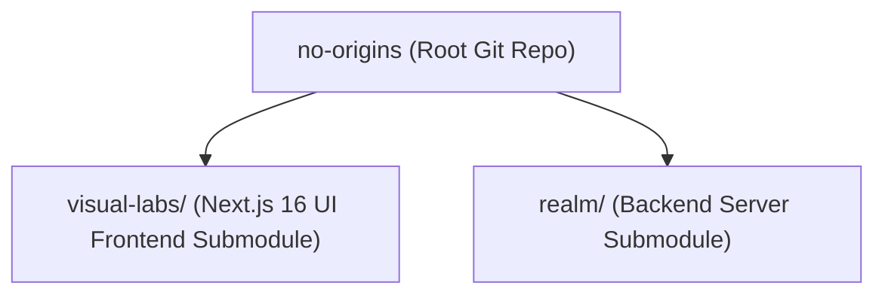
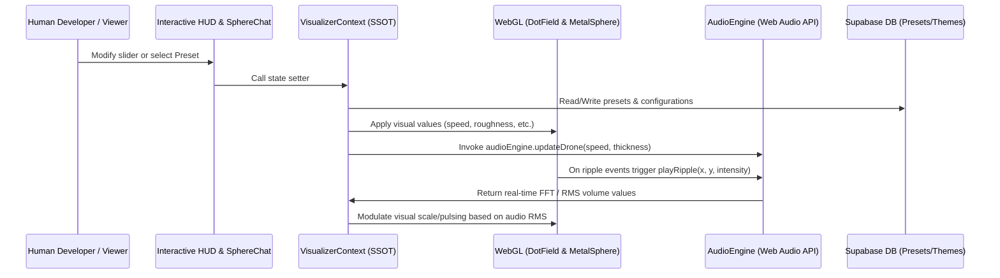

# No Origins Ecosystem Architecture

This document describes the high-level layout, tech stack, and module organization of the **No Origins** ecosystem.

---

## 🏛️ Repository Layout

The workspace is structured as a multi-component mono-repository leveraging Git submodules to isolate front-end and back-end logic.

- **[no-origins (Root)](file:///Users/hiddenstack/Creatives/no-origins)**: Contains the umbrella configuration, [GEMINI.md](file:///Users/hiddenstack/Creatives/no-origins/GEMINI.md) developer/agent rules, and global workflows.
- **[visual-labs/](file:///Users/hiddenstack/Creatives/no-origins/visual-labs)**: Next.js 16 (React 19, Tailwind CSS v4) client-side application hosting the interactive sandbox, procedural audio engine, and WebGL particle visualization.
- **[realm/](file:///Users/hiddenstack/Creatives/no-origins/realm)**: Backend services (Supabase schema, configurations, syncing presets and user state variables).

---

## 💻 Tech Stack & Dependencies

### Frontend (`visual-labs`)
- **Core Framework**: **Next.js 16.2** (App Router structure using Turbopack in development, React 19.2, TypeScript).
- **Styling**: **Tailwind CSS v4** coupled with dynamically-injected CSS Custom Properties (CSS variables) to support reactive designer themes.
- **Visual Rendering**: WebGL-based custom rendering utilizing `<canvas>` elements for the floating metal orb and background particle fields.
- **Audio Engine**: Custom built class inside `audio.ts` utilizing the browser's native **Web Audio API** (Oscillators, Gain nodes, BiquadFilters, Analysers, ConvolverNode reverb, and white noise synthesizers).
- **Transitions & Micro-Interactions**: Framer Motion 12 (`motion` package) for HUD panel animations.
- **State Management**: **React Context** (`VisualizerContext`) serving as the unified single source of truth (SSOT) managing all visual, audio, UI, preset, and theme state.
- **Backend Integrations**: Supabase JavaScript client (`@supabase/supabase-js`, `@supabase/ssr`) for storing client presets and syncing global settings.
- **AI Integrations**: Google GenAI SDK (`@google/genai`) enabling communication with the Sentient Sphere chatbot.

### Backend (`realm`)
- Serves as the database management layer storing preset schemas, design themes, and user configurations.
- Interfaced via Supabase SSR client integrations inside the Next.js frontend.

---

## ⚙️ Communication & Data Flow

- **State Sync**: React context acts as a unidirectional loop where parameters are adjusted in the HUD, applied directly to WebGL state references, and fed to the `audioEngine` via the context's effect loops.
- **Sound Reactivity**: The visualizer can read back real-time audio analysis data (RMS and frequency bands from `audioEngine.getAudioVolumeData()`) to modulate parameters like sphere scaling, providing true visual-audio synchronicity.
