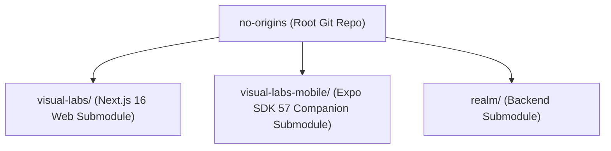
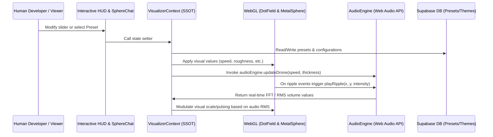

# No Origins Ecosystem Architecture

This document describes the high-level layout, tech stack, and module organization of the **No Origins** ecosystem.

---

## 🏛️ Repository Layout

The workspace is structured as a multi-component mono-repository leveraging Git submodules to isolate front-end and back-end logic.

- **[no-origins (Root)](file:///Users/hiddenstack/Creatives/no-origins)**: Contains umbrella configuration, [GEMINI.md](file:///Users/hiddenstack/Creatives/no-origins/GEMINI.md) developer/agent rules, and global workflows.
- **[visual-labs/](file:///Users/hiddenstack/Creatives/no-origins/visual-labs)**: Next.js 16 (React 19, Tailwind CSS v4) client-side web application hosting the interactive sandbox, procedural audio engine, tldraw whiteboarding canvas, and WebGL particle visualization.
- **[visual-labs-mobile/](file:///Users/hiddenstack/Creatives/no-origins/visual-labs-mobile)**: Expo SDK 57 / React Native mobile companion application featuring Skia visual graphics, biometrics, mobile social feed, push token registration, and EAS build pipelines.
- **[realm/](file:///Users/hiddenstack/Creatives/no-origins/realm)**: Backend services (Supabase migrations `0001`–`0010`, preset schemas, social feed, moderation queues, account deletion RPCs, and Mezmo Aura agent society).

---

## 💻 Tech Stack & Dependencies

### Frontend Web (`visual-labs`)
- **Core Framework**: **Next.js 16** (App Router structure using Turbopack in development, React 19, TypeScript).
- **Styling**: **Tailwind CSS v4** coupled with dynamically-injected CSS Custom Properties (CSS variables) to support reactive designer themes. Uses a global `--radius-button` token (set to `9999px`) in the base layer to enforce unified pill-shaped buttons across HUD, admin panels, and nav toggles, replacing ad-hoc rounded utility classes.
- **Component UI**: **shadcn/ui** (Radix UI primitives) integrated directly with Tailwind v4 structure mapping.
- **Visual Rendering**: WebGL-based custom rendering utilizing `<canvas>` elements for the floating metal orb (`LiquidMetalSphere`) and background particle fields (`DotField`).
- **Audio Engine**: Custom built class inside `audio.ts` utilizing the browser's native **Web Audio API** (Oscillators, Gain nodes, BiquadFilters, Analysers, ConvolverNode reverb, detent scroll/click haptic voices, and white noise synthesizers).
- **Transitions & Micro-Interactions**: Framer Motion 12 (`motion` package) for HUD panel animations, and **GSAP** (`gsap` package) for complex interactive animations like 3D tile tilts and magnetic physics.
- **Collaborative Canvas**: **tldraw** (`tldraw` package) for spatial boarding, with customized shape utilities, public published project read-only access (`/projects/[id]`), and **TipTap** (`@tiptap/react` package) for nested rich-text document integration.
- **State Management**: **React Context** (`VisualizerContext`) serving as the unified single source of truth (SSOT) managing all visual, audio, UI, preset, and theme state.
- **Backend Integrations**: Supabase JavaScript client (`@supabase/supabase-js`, `@supabase/ssr`) for storing client presets, social feed data, user profiles, and syncing global settings.
- **AI Integrations**: Google GenAI SDK (`@google/genai`) enabling communication with the Sentient Sphere chatbot.

### Mobile Companion (`visual-labs-mobile`)
- **Framework**: **Expo SDK 57** (React Native 0.76+, Expo Router v4, TypeScript).
- **Styling & Theming**: NativeWind v4 (Tailwind CSS for React Native) paired with `SectionProvider` accent context mirroring web route themes.
- **Graphics & Shaders**: `@shopify/react-native-skia` for hardware-accelerated Skia canvas rendering of background dot fields (`FieldBackground.tsx`) and liquid metal sphere SkSL shaders (`sphereShader.ts`).
- **Authentication & Security**: Supabase JS client (`src/supabase.ts`) with `expo-local-authentication` (`BiometricGate.tsx`, `biometrics.ts`) for Face ID / Touch ID gatekeeping.
- **Features & Parity**: Mobile social feed (`app/(tabs)/feed.tsx`), post creation (`app/compose.tsx`), profile username/avatar editing (`app/(tabs)/profile.tsx`), projects list with open-on-web WebView (`app/project/[id].tsx`), moderation/report queue (`app/admin/reports.tsx`), and Expo Push Notifications (`src/push.ts`).
- **Build Pipeline**: EAS Build (`eas.json` profiles: `development`, `development-simulator`, `preview`, `production`), bundle identifier `com.noorigins.visuallabs`, Expo Updates (`expo-updates`), and simulator helper script (`scripts/run-ios-sim.sh`).

### Backend (`realm`)
- Serves as the database management layer storing preset schemas, design themes, user profiles, social feed (`posts`, `likes`, `comments`, `follows`), push tokens (`push_tokens`), moderation queue (`reports`, `blocks`), and account deletion RPC (`delete_own_account()`).
- Interfaced via Supabase SSR client integrations inside the Next.js web application and Supabase JS client inside the Expo mobile application.

---

## ⚙️ Communication & Data Flow

- **State Sync**: React context acts as a unidirectional loop where parameters are adjusted in the HUD, applied directly to WebGL state references, and fed to the `audioEngine` via the context's effect loops.
- **Sound Reactivity**: The visualizer can read back real-time audio analysis data (RMS and frequency bands from `audioEngine.getAudioVolumeData()`) to modulate parameters like sphere scaling, providing true visual-audio synchronicity.

---

## 🔒 Security, Authentication & Role Gating

The ecosystem features a strict Role-Based Access Control (RBAC) model implemented at both the server-side middleware layer and the database layer (via Row Level Security).

### 👥 Role Taxonomy
* **Anonymous / standard user**: Has read-only access to database presets and states. Any new presets or states created by regular/anonymous users are saved to the browser's `localStorage` (local-only sandbox mode), keeping the central database clean.
* **Admin**: Users promoted to the `admin` role in `public.profiles`. Granted full write permissions (Insert, Update, Delete) to the database tables (`component_presets`, `states`, `stages`).
* **Suspended Account**: Users with a status of `suspended` inside `public.profiles`. They are banned from all authenticated pages (`/projects`, `/admin`) via a matching middleware check, and blocked from database mutations via RLS.

### 🛡️ Access Control & 2FA Enforcement
Authentication paths and console access routes are protected by Next.js SSR middleware ([middleware.ts](file:///Users/hiddenstack/Creatives/no-origins/visual-labs/src/utils/supabase/middleware.ts)) and backed by database constraints:

1. **Authentication Check**: Anonymous users attempting to reach protected paths (such as `/admin` or `/projects`) are redirected to `/login`.
2. **Account Suspension (Ban)**: If authenticated, the middleware looks up the profile's `status`. If the user is suspended, they are instantly redirected to `/login` with an account suspension error. This is enforced at the data layer using the SQL helper `public.is_active()`, which gates all insert, update, and delete actions across the `projects` and `project_versions` tables.
3. **Role Gate**: To reach `/admin`, the middleware verifies that the user is an active admin. Non-admins are redirected back to the home page (`/`).
4. **MFA (2FA) Enforcement**:
   - **Client-Side Gate**: Active admins must complete Multi-Factor Authentication (MFA) to reach `/admin`. If they have no factor enrolled, they are routed to `/login/setup-mfa`. If enrolled but not verified, they are routed to `/login/mfa`. Elevated access level (`aal2`) triggers a hard navigation reload.
   - **Database-Side Gate**: To prevent bypasses of the client-side router, the SQL function `public.is_admin()` verifies that the caller's session carries a verified second factor (`coalesce(auth.jwt() ->> 'aal', '') = 'aal2'`). Bypassing TOTP gates via direct API requests results in database-level write rejections.

---

## 🌐 Environment Stages

The application behavior and initial appearance adapt to the environment in which it is running, resolved at build time:

* **Trigger**: Managed via the `NEXT_PUBLIC_APP_STAGE` environment variable (value is `DEVELOPMENT`, `STAGING`, or `RELEASE`).
* **Environment Mapping**: Mapped via the `stages` database table which binds stage names to specific States and Themes.
* **Boot Flow**: On load, the system detects the active stage, pulls the corresponding state/theme from the database, and instantly applies it, ensuring users see the designed environment for that specific deployment stage.
