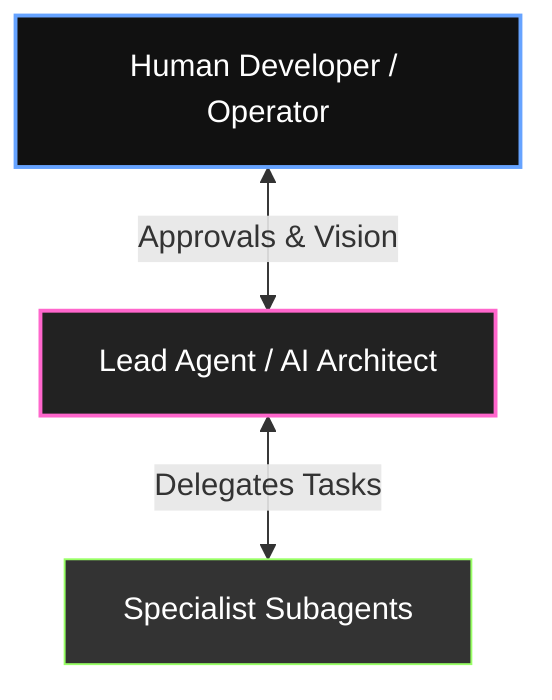
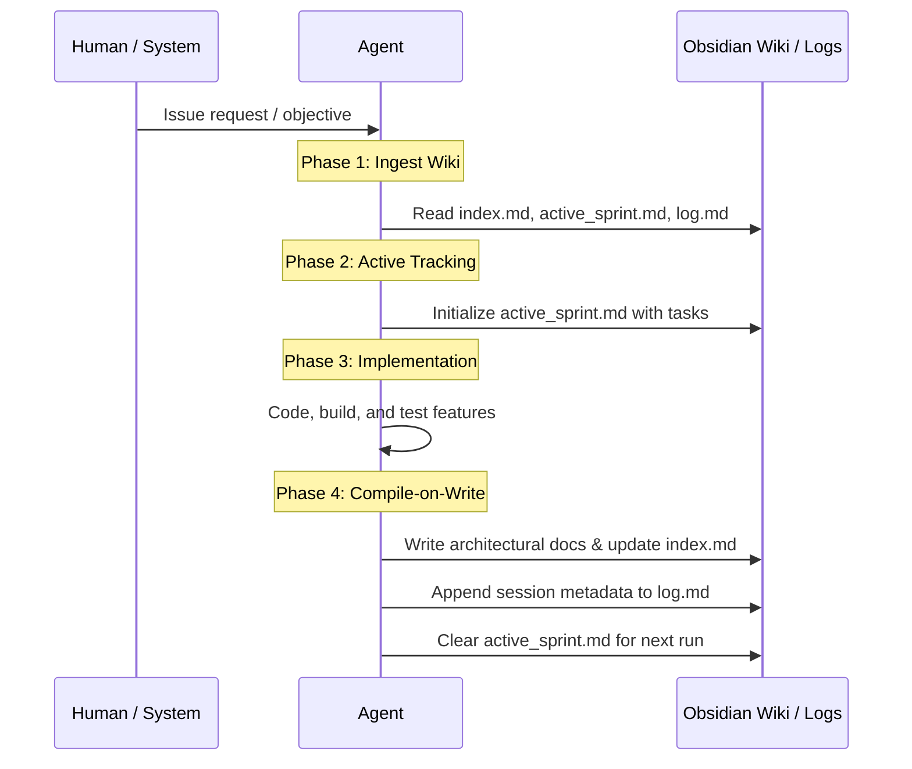

# No Origins Collaborative Development Guidelines & Pipelines

This document outlines the co-creation framework for **No Origins**. It defines how the human developer, coordination agents (like Antigravity), and specialized subagents collaborate safely, maintain codebase integrity, and compound project knowledge.

---

## 👥 1. The Collaborative Triad (Roles & Responsibilities)

Building **No Origins** is a team effort divided among three distinct roles:



### 👤 The Human Developer (Vision & Gatekeeper)
*   **Role**: Guides high-level architecture, specifies UI/UX aesthetics, and writes core complex features.
*   **Responsibility**: Acts as the ultimate authority. Authorizes all high-risk operations (HITL), reviews implementation plans, and performs database schema mutations.

### 🧠 The Lead Agent / AI Architect (Coordinator & Planner)
*   **Role**: Antigravity (or Level 1 Orchestrators inside `realm`).
*   **Responsibility**: Decomposes complex human requests into structured tasks, drafts the `implementation_plan.md` artifact, coordinates with subagents, builds components, and maintains the persistent Wiki.

### 🛠️ Specialist Subagents (Targeted Execution)
*   **Role**: Single-focus workers (e.g. styling, math, database synchronization, telemetry auditing).
*   **Responsibility**: Run specialized scripts, audit performance, write test suites, and perform narrow research tasks in isolated branches.

---

## 🏗️ 2. Development Pipelines & Life-Cycles

### 🔄 The Git Submodule Pipeline (The Golden Rule)
Since `visual-labs` and `realm` are standalone Git submodules, committing changes directly inside the submodules without updating the parent root reference will break the repository pointers. 

All code changes must follow this four-step pipeline:

```
Step 1: Write & Test Code inside the Submodule directory (e.g., visual-labs/)
   │
   ▼
Step 2: Stage, Commit, and Push Submodule changes first:
        $ git add . && git commit -m "feat: design visualizer presets" && git push origin main
   │
   ▼
Step 3: Navigate to root directory and Stage the Submodule pointer change:
        $ cd .. && git add visual-labs
   │
   ▼
Step 4: Commit and Push the Root Repository pointer update:
        $ git commit -m "chore: update visual-labs reference pointer" && git push origin main
```

---

### 📝 The Agent-Wiki Collaboration Pipeline (MANDATORY)
To prevent agents from losing context between sessions, we maintain a persistent Wiki inside Obsidian. For any project, Obsidian serves as the central Wiki workspace, located inside the `Wikis/` folder (e.g., `Wikis/no-origins/`). Every development session follows this pipeline:



---

## 🔒 3. Technical Safety Gates & HITL Checkpoints

To ensure the visualizer doesn't crash and APIs are not depleted, all agents must operate within these safety boundaries:

### 🚦 Human-in-the-Loop (HITL) Checkpoints
Agents **MUST** halt execution and prompt the human developer for approval before performing any of the following **High-Risk Actions**:
1.  Running database schema migrations (`sql` execution).
2.  Updating dependencies or installing packages (`npm install`, `cargo update`).
3.  Writing permanent code changes directly into `/src` or `/crates` (except for approved implementation plan executions).
4.  Modifying git submodule pointers.

### 📐 Settings Clamping
When agents propose settings adjustments to the WebGL particle field:
*   Physical constraints must be programmatically clamped (e.g., `fieldGap` must stay between `5` and `50`, wind speed must stay below `10.0`).
*   No agent should set random, non-curated presets. Settings must map to database-backed `stateId` models or clear interpolation curves to prevent visual glitches.

---

## 🎨 4. Coding & Documentation Best Practices

-   **Zero Placeholders**: Never write code containing empty comments, `TODO` flags, or stub functions. Code must be immediately runnable and complete.
-   **Absolute Markdown Links**: Every file, component, or system symbol referenced in documentation must use standard Markdown links using the absolute `file:///` scheme (e.g., `[VisualizerContext](file:///Users/hiddenstack/Creatives/no-origins/visual-labs/src/context/VisualizerContext.tsx)`). Do **not** wrap links in backticks.
-   **Maintain Comments**: Retain all existing docstrings, header blocks, and utility comments unless refactoring them directly.
