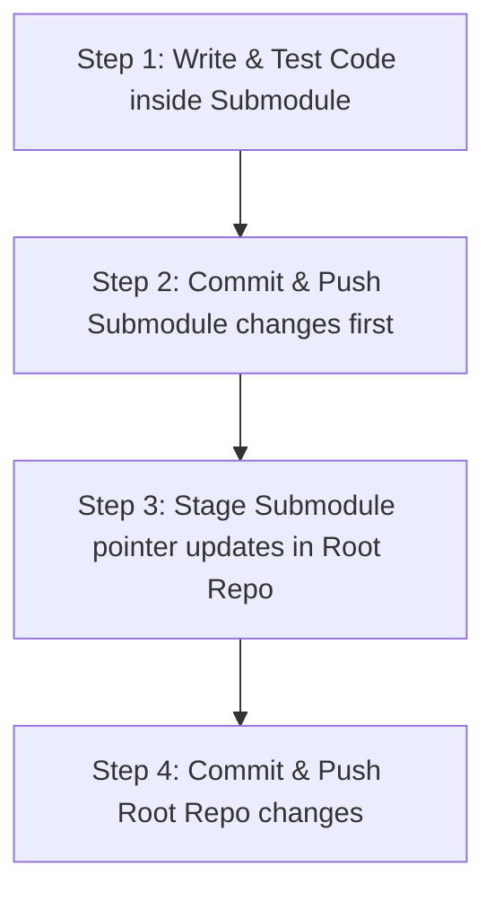

# Git Submodule Workflows

This document establishes the workflows and repository guidelines for managing the multi-module Git layout in the **No Origins** project.

---

## ⚠️ The Submodule Golden Rule

Because `visual-labs` and `realm` are standalone Git submodules, committing changes directly inside the submodules without updating the parent root references leads to **broken pointer references (detached HEAD states)**.

Always follow the three-step flow when pushing changes:



---

## 🛠️ Step-by-Step Command Flow

### Step 1: Make modifications in the target component
All coding tasks must take place inside the sub-directories:
```bash
# E.g., for front-end visual elements
cd visual-labs
```

### Step 2: Commit and push changes inside the Submodule
Commit the files directly to the remote repository of that specific submodule.
```bash
git add .
git commit -m "feat: implement responsive WebGL resizing"
git push origin main
```

### Step 3: Update the reference pointer in the Root Repo
Navigate back to the parent `no-origins` root folder. Running `git status` will show the submodule has modified content (a different commit hash pointer).
```bash
cd ..
git status
# You will see: modified:   visual-labs (new commits)
```
Stage the pointer update:
```bash
git add visual-labs
```

### Step 4: Commit the pointer update to the Root Repo
```bash
git commit -m "chore: update visual-labs reference pointer"
git push origin main
```

---

## 🚨 Troubleshooting Common Mistakes

### 1. Detached HEAD in Submodules
If a submodule is in a detached HEAD state (not pointing to a branch):
```bash
cd visual-labs
git checkout main
git pull origin main
```

### 2. Discarding local changes in submodules
To completely reset a submodule to match the pointer checked out by the parent repository:
```bash
# In the root repository
git submodule update --init --recursive --force
```

### 3. Cloning the repository for the first time
If someone clones `no-origins`, submodules will be empty folders. They must be initialized:
```bash
git clone https://github.com/your-username/no-origins.git
cd no-origins
git submodule update --init --recursive
```
