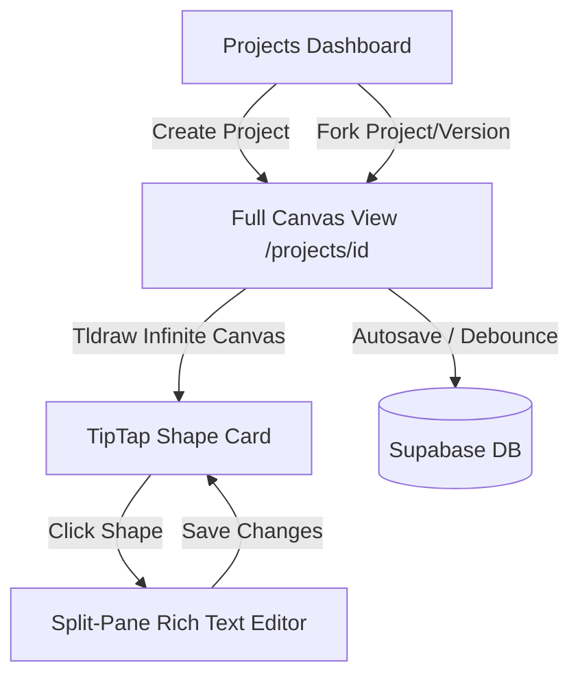

# RFC: Projects Feature (Spatial Canvas & Document Hub)

This Request for Comments (RFC) outlines the architectural, data, and user experience specifications for the **Projects** feature in No Origins. It introduces an interactive, spatial media whiteboard integrating **tldraw** with custom **TipTap** document cards, backed by Supabase replication, publishing, versioning, and forking.

---

## 🗺️ Architectural Overview

The Projects feature operates as a standalone workspace subpage (`/projects`). It comprises two key view states:
1. **Projects Dashboard (`/projects`)**: A glassmorphic control center for managing personal projects and discovering/forking community-published projects.
2. **Project Canvas (`/projects/[id]`)**: A full-viewport infinite board powered by `tldraw` that hosts standard drawing components alongside custom TipTap text shapes.



---

## 🗄️ Database Schema & Security

To support publishing, forking, and version control, we introduce two new tables in Supabase: `projects` and `project_versions`.

### 1. `public.projects`
Represents a user's project workspace.

```sql
create table public.projects (
  id                     uuid primary key default gen_random_uuid(),
  owner_id               uuid not null references public.profiles (id) on delete cascade,
  name                   text not null,
  description            text,
  canvas_data            jsonb not null default '{}'::jsonb, -- Tldraw document state
  is_published           boolean not null default false,
  forked_from_project_id uuid references public.projects (id) on delete set null,
  forked_from_version_id uuid, -- Reference to specific version
  created_at             timestamptz not null default now(),
  updated_at             timestamptz not null default now()
);

-- Enable RLS
alter table public.projects enable row level security;
```

### 2. `public.project_versions`
Stores snapshots of projects at specific release milestones. Versions follow Semantic Versioning (`major.minor.patch`), where version numbers are system-computed based on user-chosen release types.

```sql
create table public.project_versions (
  id            uuid primary key default gen_random_uuid(),
  project_id    uuid not null references public.projects (id) on delete cascade,
  major_version integer not null check (major_version >= 0),
  minor_version integer not null check (minor_version >= 0),
  patch_version integer not null check (patch_version >= 0),
  canvas_data   jsonb not null,    -- Snapshot of tldraw document state
  description   text,             -- Release notes / changelog
  published_at  timestamptz not null default now(),
  
  -- Prevent duplicate version coordinates per project
  unique (project_id, major_version, minor_version, patch_version)
);

-- Add foreign key constraint back to projects
alter table public.projects 
  add constraint fk_projects_forked_version 
  foreign key (forked_from_version_id) 
  references public.project_versions (id) on delete set null;

-- Enable RLS
alter table public.project_versions enable row level security;
```

### 3. Row Level Security (RLS) Policies
* **Select**:
  * Users can read any project/version if they are the owner OR if `is_published = true`.
* **Insert/Update/Delete**:
  * Users can mutate only projects/versions they own (`owner_id = auth.uid()`).
  * Admins (`is_admin()`) have global override capabilities.

---

## 🎨 Frontend Architecture (`visual-labs`)

### 1. TipTap Shape Component in Tldraw
We register a custom shape type in `tldraw` (e.g., `TipTapCardShape`).
* **Canvas Presentation**: 
  * Displays as a sleek, fully-rounded glassmorphic **pill** in its default resting state (`48px` height).
  * The default pill contains a **Notes icon** on the left, the **Title** header in the middle (truncated with ellipsis), and a circular **Pencil write icon button** on the right.
  * When a **Description** is added to the document, hovering over the pill smoothly animates it (transitions `height` to `auto` / `max-height: 320px`, morphs border-radius to `18px` card curves, and fades in the content) to reveal the description text, tags list, word count, and timestamp metadata. If no description is added, it stays in its compact pill shape on hover.
* **Interaction**:
  * Draggable and resizable (width-adjustable) using standard tldraw handlers.
  * Clicking the Pencil edit button opens the **Split-Pane Editor** on the right side of the screen.

### 2. Split-Pane Rich Text Editor
* **Layout**: Responsive split screen. On desktop screens (>=1024px), the canvas and editor render side-by-side inside a resizable panel layout. On mobile screens, the editor overlays the canvas as a full-screen drawer.
* **TipTap Setup**: Mounts the TipTap editor instance equipped with a default toolbar.
* **Fields**:
  * **Title Input** (updates the card title on the canvas).
  * **Description Input** (short textarea summary to display on hover).
  * **Tags Input** (pills list to classify the document).
  * **Rich Text Editor Area** (TipTap).
* **Save/Sync Trigger**: Clicking "Save" closes the pane, commits the title, description, tags, HTML content, and wordCount to the tldraw shape's `props`, and initiates a Supabase sync.

### 3. Autosave Engine
* Standard drawings and canvas changes are debounced (e.g., 2000ms) and sent to a Next.js Server Action or API Route to update `projects.canvas_data`.
* TipTap split-pane edits update the canvas state locally and queue an autosave upon pane close or manual save.

### 4. Project Dashboard View (`/projects`)
Rendered under a full-width glassmorphic layout:
* **My Workspace**:
  * Grid of user's personal projects using `BorderGlow` cards.
  * "Create Project" triggers creation of a blank canvas with a default set of TipTap cards.
  * Options to Edit, Delete, or **Publish Version**.
    * *Note on Publishing*: A new project starts implicitly at `0.0.0`. When publishing, the UI prompts the user to select the release type:
      * **Major Version**: Increments the major digit (e.g., `1.0.0` -> `2.0.0`), resetting minor and patch to `0`.
      * **Changes Within Version**: Increments the minor digit (e.g., `1.0.0` -> `1.1.0`), resetting patch to `0`.
      * **Minor Improvements**: Increments the patch digit (e.g., `1.1.0` -> `1.1.1`).
      * Alternatively, the owner can overwrite (mutate) an existing published version.
      * *All calculations are system-managed; the user cannot input arbitrary version strings.*
* **Discovery Hub**:
  * Lists published projects from other users.
  * Version selector dropdown allowing users to choose which SemVer version (e.g. `1.1.0`) to explore or fork.
  * **Fork Button**: Creates a new project in the user's workspace, copying the selected version's `canvas_data`.

---

## 🌐 Navigation & Theme Integration

* **WebGL InfiniteMenu**:
  * Registered as `PROJECTS` (Index 6).
  * **Symbol**: A custom folder/canvas geometry (layers icon).
  * **Accent Color**: Emerald Green (`#10b981`) or Teal (`#0d9488`) matching the creative workspace theme.
* **Theme Styling**:
  * Complete integration with Tailwind v4 utility variables and dark-mode styles.
  * Glassmorphism (`backdrop-blur-md`, `bg-neutral-900/80`, glowing borders) matched exactly with the existing HUD overlays.

---

## 🛠️ Whiteboard UI & Command Palette Refactoring

A major refactoring of the spatial whiteboard interface was conducted to clean up overlays and integrate advanced control capabilities:

1. **Custom Shape Utilities**:
   - In addition to standard drawings and TipTap documents, the whiteboard canvas registers two new custom media shapes:
     - **Link Preview Card (`UrlCardShapeUtil`)**: Represents a URL bookmark card. When dropped onto the canvas, it makes a lazy API request to the scraper route `/api/link-preview` to fetch Open Graph metadata (title, description, and preview image), rendering a beautiful glassmorphic bookmark card inline.
     - **YouTube Video Card (`YouTubeCardShapeUtil`)**: Embeds an interactive, responsive YouTube video iframe directly onto the drawing board, allowing users to watch media in place.
   - Both shapes are draggable, resizable, and use custom HTML rendering overlays in Tldraw.

2. **TipTap Card Toolbar & Media Integration**:
   - The standalone "Add TipTap Card" button was removed from the floating header HUD.
   - It is now fully integrated as a native tool button at the end of the default Tldraw toolbar, using a standard document/text [FileText](file:///Users/hiddenstack/Creatives/no-origins/visual-labs/src/components/projects/TldrawCanvas.tsx) icon.
   - Clicking this tool button immediately spawns a new TipTap shape at the center of the viewport.

3. **Shadcn Command Palette**:
   - Hides the default Tldraw top-left controls (`MainMenu` hamburger, `PageMenu` page selector, `QuickActions` buttons like delete/duplicate, and `ActionsMenu` three-dots dropdown) to clear the canvas frame completely.
   - The palette is triggered by clicking a floating circular button in the bottom-left corner of the viewport (styled with a `Terminal` icon and active section accent glow), or by pressing the system-wide shortcut `Cmd+K` / `Ctrl+K`.
   - All whiteboard and document controls are migrated into this unified Command palette:
     - **Whiteboard Tools**: Select, Draw, Text, Eraser, Hand, Laser, Add TipTap Card, Add URL Preview, Add YouTube Video.
     - **Canvas Actions**: Undo, Redo, Toggle Grid Mode, Zoom to Fit.
     - **Page Management** (rebuilds dynamically using `useValue` signals): Create New Page, Delete Current Page, Rename Current Page, and switch between existing pages.
     - **Selection Actions** (displayed dynamically when one or more shapes are selected): Duplicate Selected (with selection count), Delete Selected, and Group Selected Shapes.
     - **Navigation**: Back to Dashboard, Go to Home Page.

4. **Floating HUD Controls & "Back to Content" Locator**:
   - **Floating Canvas HUD**: Consists of a simple, clean header bar. The left side houses a circular button to return to the Projects dashboard. The right side shows active cloud syncing status (`SAVING SNAPSHOT...`, `CLOUD SYNCED`, `SYNC ERROR`).
   - **Back to Content Button ([BackToContentButton.tsx](file:///Users/hiddenstack/Creatives/no-origins/visual-labs/src/components/projects/BackToContentButton.tsx))**: A custom self-contained floating glass pill button. It mirrors tldraw's default helper button but is styled in premium dark glassmorphism. It uses a custom `useValue` reactive check matching `editor.getNotVisibleShapes()` to only render when the canvas has shapes and *every one of them* is currently scrolled off-screen. Clicking it triggers a smooth bounding transition (`zoomToBounds`) framing the page contents without zooming past 100%.

5. **Theme & Glassmorphism Styling**:
   - All custom overlay dialogs, input panels, and command item list components use absolute monospace typography (`font-mono`) and dark glassmorphic styling (`bg-neutral-950/60` with `backdrop-filter: blur(24px)` and thin `border-white/8` outline).
   - Command list items feature custom active states styled with a glowing section background (`bg-section/10`) and text outline (`text-section`).

6. **Desktop Resizable Split Layout**:
   - On desktop/large screens (>=1024px), the whiteboard canvas and the TipTap editor render side-by-side inside a resizable layout using a custom Shadcn `ResizablePanelGroup` component.
   - The Tldraw component is kept continuously mounted in the canvas panel, preventing zoom/selection resets or canvas reloads when opening/closing the editor.
   - On mobile/tablet screens, the layout automatically adapts to a full-screen overlay drawer (`w-full` width) when writing or editing.


