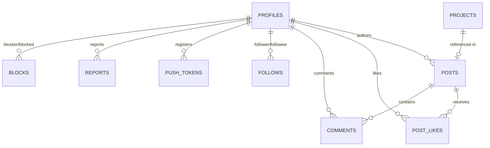

# Social Feed, Moderation & Push Tokens Database Schema

This document details the database schema, security policies, storage configuration, and stored procedures for the social feed, moderation, push notifications, and self-service account deletion across web and mobile applications in **No Origins**.

---

## 📊 Database Tables & Data Model

The social layer and moderation system are implemented in Supabase migrations `0005_social_feed.sql`, `0006_push_tokens.sql`, `0007_moderation.sql`, `0008_account_deletion.sql`, and profile handles in `0009_profile_username.sql`.



---

## 👤 Profile username (`0009_profile_username.sql`)

| Item | Detail |
| :--- | :--- |
| Column | `public.profiles.username` — nullable `text` |
| Format | `^[a-z0-9_]{3,24}$` (stored lowercased) |
| Uniqueness | Partial unique index where `username is not null` |
| RPC | `set_own_username(desired text)` → returns the updated profile row |
| RLS | Authenticated active users may `UPDATE` their own row; trigger `profiles_guard_columns` blocks non-admin changes to `role` / `status` / `email` / `id` |
| UI | Web `/profile` + mobile Profile tab — feed shows `@username` when set, else email local-part |

---

## 🖼 Profile avatar (`0010_profile_avatar.sql`)

| Item | Detail |
| :--- | :--- |
| Column | `public.profiles.avatar_path` — nullable `text` |
| Storage | Public `media` bucket path under `{auth.uid()}/avatar/…` |
| RPC | `set_own_avatar(desired text)` → validates path prefix, updates row, returns profile |
| Clear | Pass empty string / null to clear; clients delete the storage object |
| Display | Clients resolve `mediaPublicUrl(avatar_path)` first, else OAuth `user_metadata.avatar_url` / `picture`, else initials |
| Deletion | `delete_own_account()` clears `avatar_path` |
| UI | Edit profile on web + mobile (upload / replace / remove); feed author chips show photo |

---

## 📝 1. Social Feed Tables

### `public.posts`
Represents user-generated content entries. Posts can contain text body, an uploaded image path in Storage, or a linked project reference.

```sql
create table if not exists public.posts (
  id          uuid primary key default gen_random_uuid(),
  author_id   uuid not null references public.profiles (id) on delete cascade,
  category    text check (category is null or category in ('story', 'society', 'community')),
  body        text not null default '',
  image_path  text,
  project_id  uuid references public.projects (id) on delete set null,
  hidden      boolean not null default false,
  created_at  timestamptz not null default now(),
  updated_at  timestamptz not null default now(),
  constraint posts_has_content check (
    length(trim(body)) > 0
    or image_path is not null
    or project_id is not null
  )
);
```

### `public.post_likes`
Junction table tracking post likes with a primary key pair `(post_id, user_id)`.

```sql
create table if not exists public.post_likes (
  post_id    uuid not null references public.posts (id) on delete cascade,
  user_id    uuid not null references public.profiles (id) on delete cascade,
  created_at timestamptz not null default now(),
  primary key (post_id, user_id)
);
```

### `public.comments`
Comments posted on specific feed items. Includes a `hidden` boolean flag for moderation take-downs.

```sql
create table if not exists public.comments (
  id         uuid primary key default gen_random_uuid(),
  post_id    uuid not null references public.posts (id) on delete cascade,
  author_id  uuid not null references public.profiles (id) on delete cascade,
  body       text not null check (length(trim(body)) > 0),
  hidden     boolean not null default false,
  created_at timestamptz not null default now()
);
```

### `public.follows`
User-to-user follow relationships with constraint `follower_id <> followee_id`.

```sql
create table if not exists public.follows (
  follower_id uuid not null references public.profiles (id) on delete cascade,
  followee_id uuid not null references public.profiles (id) on delete cascade,
  created_at  timestamptz not null default now(),
  primary key (follower_id, followee_id)
);
```

---

## 📱 2. Push Tokens Table

### `public.push_tokens`
Stores Expo push notification tokens registered by mobile or web clients for notification fan-out.

```sql
create table if not exists public.push_tokens (
  id         uuid primary key default gen_random_uuid(),
  user_id    uuid not null references public.profiles (id) on delete cascade,
  token      text not null unique,
  platform   text not null check (platform in ('ios', 'android', 'web')),
  created_at timestamptz not null default now()
);
```

---

## 🛡️ 3. Moderation & UGC Safety

### `public.reports`
UGC safety report queue allowing authenticated users to report inappropriate posts, comments, or users. Admins review open reports via the admin queue (`app/admin/reports.tsx`).

```sql
create table if not exists public.reports (
  id           uuid primary key default gen_random_uuid(),
  reporter_id  uuid not null references public.profiles (id) on delete cascade,
  target_type  text not null check (target_type in ('post', 'comment', 'user')),
  target_id    uuid not null,
  reason       text not null default '',
  status       text not null default 'open' check (status in ('open', 'actioned', 'dismissed')),
  created_at   timestamptz not null default now(),
  updated_at   timestamptz not null default now()
);
```

### `public.blocks`
User block relationships. Blocked users' posts and comments are automatically excluded from the blocker's feed view.

```sql
create table if not exists public.blocks (
  blocker_id  uuid not null references public.profiles (id) on delete cascade,
  blocked_id  uuid not null references public.profiles (id) on delete cascade,
  created_at  timestamptz not null default now(),
  primary key (blocker_id, blocked_id)
);
```

---

## 🖼️ 4. Media Storage Bucket

The `media` bucket is configured in Supabase Storage for user image uploads attached to social posts:

- **Bucket ID**: `media` (Public = `true`).
- **File Size Limit**: 10 MB.
- **Allowed MIME Types**: `image/jpeg`, `image/png`, `image/webp`, `image/heic`, `image/heif`.
- **Upload Path**: Users upload files exclusively under `{auth.uid()}/...`.

---

## ⚡ 5. Account Deletion Stored Procedure

App Store guidelines require in-app self-service account teardown. The RPC function `delete_own_account()` performs instant content wiping and profile suspension:

```sql
create or replace function public.delete_own_account()
returns void
language plpgsql
security definer
set search_path = public
as $$
declare
  uid uuid := auth.uid();
begin
  if uid is null then
    raise exception 'not authenticated';
  end if;

  -- Soft-hide authored UGC so it leaves every feed immediately
  update public.posts set hidden = true where author_id = uid;
  update public.comments set hidden = true where author_id = uid;

  -- Drop social graph, likes, tokens, and reports
  delete from public.post_likes where user_id = uid;
  delete from public.follows where follower_id = uid or followee_id = uid;
  delete from public.blocks where blocker_id = uid or blocked_id = uid;
  delete from public.push_tokens where user_id = uid;
  delete from public.reports where reporter_id = uid;

  -- Suspend profile and clear email (revokes is_active write gates)
  update public.profiles
  set status = 'suspended', email = null
  where id = uid;
end;
$$;
```

---

## 🔗 Related Documentation

- [Presets Schema](file:///Users/hiddenstack/Creatives/no-origins/wiki/realm/presets_schema.md)
- [Mobile App Plan](file:///Users/hiddenstack/Creatives/no-origins/wiki/visual-labs-mobile/app_plan.md)
- [Mobile Design System](file:///Users/hiddenstack/Creatives/no-origins/wiki/visual-labs-mobile/design_system.md)
