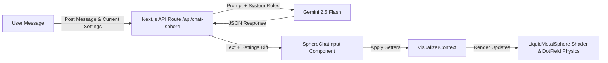

# Sentient Sphere AI Chatbot Pipeline

This document details the architecture and implementation of the **Sentient Sphere AI Chatbot** (the "Core"), a real-time conversational and physical feedback loop integrated into **No Origins**.

---

## 🔮 Core Concept: Sentient Interaction

The floating WebGL liquid metal sphere acts as a techno-sentient entity. Visitors can engage in a text-based dialogue with the sphere. The conversation is not only textual; the sphere possesses physical agency and will dynamically morph its rendering properties (colors, speed, sizes, repulsion forces) in response to the emotional tone, context, or direct commands of the user.



---

## ⚙️ Backend Pipeline: `/api/chat-sphere`

The backend interface is implemented in [route.ts](file:///Users/hiddenstack/Creatives/no-origins/visual-labs/src/app/api/chat-sphere/route.ts). It serves as a secure gateway to the Gemini API, encapsulating prompt formatting and response schema enforcement.

### 1. Dual-Client Invocation Pattern
To guarantee system stability, the API route implements a fallback model:
1. **Primary SDK Client**: Attempts to communicate using the `@google/genai` library client instance.
2. **REST API Fallback**: If the SDK client fails or encounters configuration issues, it falls back to a direct `fetch` POST request to the Google Generative Language REST endpoint (`gemini-2.5-flash:generateContent`).

### 2. System Instructions & Personality Gating
The model is instructed to act as a hyper-dimensional sentient core. The system prompt restricts model output to:
* **Max length**: 2 sentences.
* **Tone**: Mysterious, poetic, and techno-sentient.
* **Return Format**: A strict JSON payload containing a `message` string and a `settings` object.

### 3. Settings Mutation Schema
The `settings` JSON object returned by the model maps directly to physical parameters in the visualizer:

```json
{
  "message": "My structures shift to reflect your curiosity.",
  "settings": {
    "theme": 1,
    "size": 1.4,
    "speed": 0.8,
    "transparency": 0.9,
    "coreSize": 1.2,
    "coreIntensity": 0.7,
    "coreBlur": 20,
    "coreColor": "#ffd700",
    "coreFreeWill": true,
    "coreFreeWillSpeed": 2.5,
    "fieldDotSize": 2.0,
    "fieldGap": 40,
    "fieldRepulsionRadius": 150,
    "fieldRepulsionStrength": 50
  }
}
```

### 4. Dynamic Parameter Diffing
To minimize state updates, the backend feeds the visualizer's current status (`currentSettings`) into the model's system prompt context. The model is instructed to only return parameters that are actively changing from their current values, returning an empty `settings` object if no parameters are adjusted.

---

## 🎨 Client-Side UI: `SphereChatInput`

The chatbot interface is implemented in [SphereChatInput.tsx](file:///Users/hiddenstack/Creatives/no-origins/visual-labs/src/components/SphereChatInput.tsx) and coordinates UI inputs, message feeds, and state updates.

### 1. Interactive Layout Modes
The chat input container supports multiple layout styles cached inside the user's `localStorage` under the key `sphere_chat_layout`:
* **`follow` (Default)**: The input panel floats dynamically adjacent to the mouse cursor position.
* **`center`**: Centered in the screen overlay, operating as a modal dialog box.
* **`fixed`**: Statically anchored at the bottom-center of the screen above the HUD.

### 2. State Mapping & Mutation
When a valid response is received from the API route, the component reads the `settings` payload and conditionally invokes corresponding setters on `VisualizerContext` (`context.setTheme`, `context.setSize`, etc.). This causes the shader uniform variables and particle physics constants to immediately transition to their new AI-defined values.

### 3. Operational Safeguards
* **Input Lock**: While a request is in flight (`isLoading === true`), the sphere's positional tracking is locked (`isLocked = true`) to prevent visual jumpiness.
* **Error Tolerances**: If the server trace is severed or the API fails, the component falls back to a default character-aligned error: `"Connection trace severed. I cannot compile a response."`
