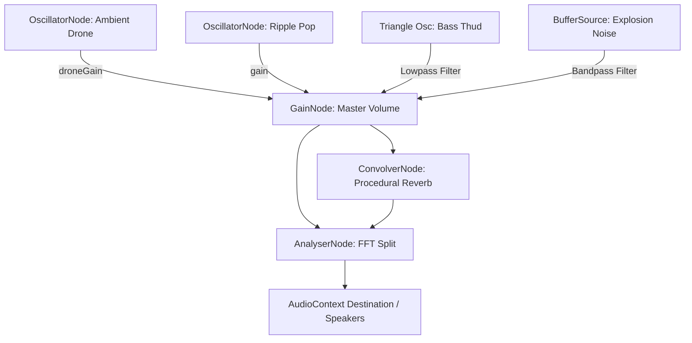

# Procedural Audio Synthesis Engine

This document details the procedural audio synthesis architecture in the **No Origins** ecosystem, implemented via the native Web Audio API in `audio.ts`.

---

## 🔊 Engine Architecture & Graph

The audio system is implemented in the [audio.ts](file:///Users/hiddenstack/Creatives/no-origins/visual-labs/src/audio.ts) class `AudioEngine`. It operates a custom routing graph to combine ambient sounds, interactive sound effects, and analysis node layers:



---

## 🌀 Synth Audio Elements

### 1. The Ambient Drone
- **Oscillator Type**: Sine wave tuned to a low base frequency (defaults to `55Hz` / A1).
- **Modulation Loop**: Responds to real-time updates from the rendering engine:
  - **Base pitch** shifts slightly with `speed` changes using a slow LFO glide.
  - **Volume** modulates based on visual orb `thickness`.
  
```typescript
const targetGain = (0.2 + (thickness * 0.1)) * this.droneVolume;
this.droneGain.gain.setTargetAtTime(targetGain, this.ctx.currentTime, 0.5);
```

### 2. The Bubble Ripple Pop
- **Trigger**: Click events on the background grid under normal state (`WAVES`).
- **Synthesis Pattern**:
  - **Pitch Sweep**: Rapid upward sweep (`baseFreq` to `baseFreq * 1.5` over 80ms) mimicking a bubble escaping water.
  - **Y-Coord Pitch Shift**: Click position controls the pitch ($Y=0$ at bottom is high pitch, $Y=1$ at top is low pitch).
  - **Envelope**: Instant attack, fast exponential decay (150ms).

### 3. The Asteroid Impact
- **Trigger**: Click events during the `ASTEROID_RAIN` field state.
- **Synthesis Pattern**: Dual-source synthesis to mimic a heavy crunch and explosion:
  1. **Low Thump (triangle wave)**: Rapid downward sweep (160Hz down to 50Hz) passed through a lowpass filter (320Hz) to create a muffled weight.
  2. **Explosion Crunch (noise burst)**: 300ms of mathematically generated white noise buffer passed through a resonant bandpass filter (220Hz, Q=2.5) with a medium decay envelope.

---

## 🔬 Real-Time Sound Analysis (FFT & RMS)

The WebGL shader and UI can query real-time volume parameters from the `AnalyserNode` using the `getAudioVolumeData()` method:

- **RMS (Root Mean Square)**: Computed from time-domain byte data to get the average sound amplitude envelope. Used to pulse UI rings and scale the metal sphere.
- **FFT Split**: Separates frequency data into a **Bass Band** (lowest 30% of spectrum bin) and **Treble Band** (remaining 70%).

```typescript
// Time Domain RMS Calculation
this.analyser.getByteTimeDomainData(this.analyserData);
let sum = 0;
for (let i = 0; i < this.analyserData.length; i++) {
  const val = (this.analyserData[i] - 128) / 128;
  sum += val * val;
}
const rms = Math.sqrt(sum / this.analyserData.length);
```

---

## ⏳ Algorithmic Reverb (ConvolverNode)
Instead of importing heavy impulse audio files, the engine generates an impulse response mathematically on startup:

- A stereo buffer filled with decaying white noise over a duration of 3 seconds.
- The decay is governed by the equation $factor = e^{-t \cdot \lambda} \times \text{noise}$, creating a smooth, metallic hall reverb.
