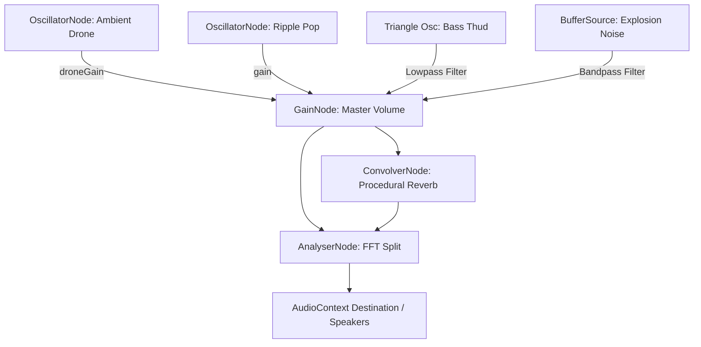

# Procedural Audio Synthesis Engine

This document details the procedural audio synthesis architecture in the **No Origins** ecosystem, implemented via the native Web Audio API in `audio.ts`.

---

## 🔊 Engine Architecture & Graph

The audio system is implemented in the [audio.ts](file:///Users/hiddenstack/Creatives/no-origins/visual-labs/src/audio.ts) class `AudioEngine`. It operates a custom routing graph to combine ambient sounds, interactive sound effects, and analysis node layers.

### Independent buses (user toggles)

| Toggle | UI control | Engine flag | What it gates |
| :--- | :--- | :--- | :--- |
| **Ambient music** | Music icon (footer) / Ambient Music in HUD | `ambientEnabled` via `toggleAmbient` | Drone only |
| **Haptic feedback** | Vibrate icon (footer) / Haptic Feedback in HUD | `hapticsEnabled` via `toggleHaptics` | Scroll ticks, ripples, impacts |

Both preferences persist in `localStorage` (`no_origins_audio_enabled`, `no_origins_haptics_enabled`). Either bus may init/resume the shared `AudioContext`.



---

## 🌀 Synth Audio Elements

### 1. The Ambient Drone
- **Oscillator Type**: Sine wave tuned to a low base frequency (defaults to `55Hz` / A1).
- **Modulation Loop**: Responds to real-time updates from the rendering engine:
  - **Base pitch** shifts slightly with `speed` changes using a slow LFO glide.
  - **Volume** modulates based on visual orb `thickness`.
  
```typescript
const targetGain = (0.2 + (thickness * 0.1)) * this.droneVolume;
this.droneGain.gain.setTargetAtTime(targetGain, this.ctx.currentTime, 0.5);
```

### 2. The Bubble Ripple Pop
- **Trigger**: Click events on the background grid under normal state (`WAVES`).
- **Synthesis Pattern**:
  - **Pitch Sweep**: Rapid upward sweep (`baseFreq` to `baseFreq * 1.5` over 80ms) mimicking a bubble escaping water.
  - **Y-Coord Pitch Shift**: Click position controls the pitch ($Y=0$ at bottom is high pitch, $Y=1$ at top is low pitch).
  - **Envelope**: Instant attack, fast exponential decay (150ms).

### 3. The Asteroid Impact
- **Trigger**: Click events during the `ASTEROID_RAIN` field state.
- **Synthesis Pattern**: Dual-source synthesis to mimic a heavy crunch and explosion:
  1. **Low Thump (triangle wave)**: Rapid downward sweep (160Hz down to 50Hz) passed through a lowpass filter (320Hz) to create a muffled weight.
  2. **Explosion Crunch (noise burst)**: 300ms of mathematically generated white noise buffer passed through a resonant bandpass filter (220Hz, Q=2.5) with a medium decay envelope.

### 4–5. Menu Detent Voice (`playDetentVoice` → scroll + click)
Shared dry synthesis for both:

1. **Bass body (triangle)** ~110Hz thump, lowpass ~280→140Hz  
2. **Mid blip (sine)** ~620Hz  
3. **Noise edge** ~12ms highpass spike  
4. **Metal hint** quiet inharmonic pair (~2.1kHz)

| API | Trigger | Difference from base voice |
| :--- | :--- | :--- |
| `playScrollTick` | Slot boundary while scrolling | Direction pan, velocity level, ≥22ms rate limit |
| `playClick` | Disc tap / enter commit | Same voice, centered, ~12% firmer, no rate limit |

- **Routing**: Master only — **no reverb**.  
- **Gating**: `hapticsEnabled` + `rippleVolume`.

---

## 🔬 Real-Time Sound Analysis (FFT & RMS)

The WebGL shader and UI can query real-time volume parameters from the `AnalyserNode` using the `getAudioVolumeData()` method:

- **RMS (Root Mean Square)**: Computed from time-domain byte data to get the average sound amplitude envelope. Used to pulse UI rings and scale the metal sphere.
- **FFT Split**: Separates frequency data into a **Bass Band** (lowest 30% of spectrum bin) and **Treble Band** (remaining 70%).

```typescript
// Time Domain RMS Calculation
this.analyser.getByteTimeDomainData(this.analyserData);
let sum = 0;
for (let i = 0; i < this.analyserData.length; i++) {
  const val = (this.analyserData[i] - 128) / 128;
  sum += val * val;
}
const rms = Math.sqrt(sum / this.analyserData.length);
```

---

## ⏳ Algorithmic Reverb (ConvolverNode)
Instead of importing heavy impulse audio files, the engine generates an impulse response mathematically on startup:

- A stereo buffer filled with decaying white noise over a duration of 3 seconds.
- The decay is governed by the equation $factor = e^{-t \cdot \lambda} \times \text{noise}$, creating a smooth, metallic hall reverb.

---

## 💾 Audio Presets & Persistence

The audio settings are synced as part of the visualizer presets and composed states:

* **Synced Parameters**: The `audio` component preset saves the following properties:
  - `audioEnabled`: Master toggle for the entire AudioContext synthesizer.
  - `audioVolume`: Master GainNode volume slider percentage.
  - `droneVolume`: Ambient drone gain level.
  - `rippleVolume`: Interactive pops/impact effects gain level.
  - `baseFreq`: Fundamental drone oscillator frequency (Hz).
  - `visualReactivityEnabled`: Toggles visual sphere displacement driven by real-time audio volumes.
  - `visualReactivityStrength`: Scale modifier for audio-driven displacement.
* **Toggle Persistence**: 
  - Ambient music → `localStorage` key `no_origins_audio_enabled`.
  - Haptic FX → `localStorage` key `no_origins_haptics_enabled` (migrates from ambient pref if unset).
  - When the app boots and resolves environment-driven States, the transition checks `preserveAudio: true`. This option overrides the database state's ambient toggle with the user's cached preference, preventing the drone from suddenly playing if the user previously muted it. Haptics stay a pure user preference and are never overwritten by sphere states.
