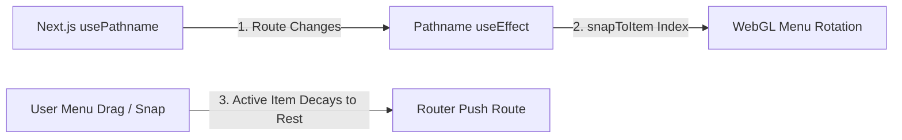

# Navigation Interface & Interactive Subpages

This document details the navigation framework of **No Origins**, specifically the high-performance WebGL-based infinite circular menu, route synchronization, the mouse-tracking reactive border glow component, and internal page templates.

---

## 🧭 Infinite Circular Menu: `InfiniteMenu`

The primary site navigation is governed by the interactive, WebGL-rendered [InfiniteMenu.tsx](file:///Users/hiddenstack/Creatives/no-origins/visual-labs/src/components/InfiniteMenu.tsx). It displays site options arranged in a 3D-like circular layout floating above the particle visualizer.

### 1. WebGL Disc & Icon Projection
- **Disc Shaders**: Uses custom vertex and fragment shaders to project flat circular nodes ("discs") onto a 3D plane.
- **Dynamic 2D Canvas Mapping**: Discs are drawn directly on a 2D canvas with glowing borders and centered system vector icons, which are cached as WebGL textures on startup (supporting offline-first loads).
- **Transparency & Layout Safeguards**: WebGL context initialization has `alpha: true` enabled, ensuring a fully transparent canvas backdrop. The container in [BackgroundVisualizer.tsx](file:///Users/hiddenstack/Creatives/no-origins/visual-labs/src/components/BackgroundVisualizer.tsx) uses responsive dimensions `w-[88vw] h-[88vw] max-w-[760px] max-h-[760px]` to prevent clipping rotated items, while sibling absolute text overlays are separated outside overflow-hidden regions.

### 2. Bidirectional Route Synchronization
The menu automatically maps and syncs its state with Next.js app routing:



- **Pathname-to-Rotation**: The menu listens to `usePathname()`. On change, it locates the matching item link and invokes `snapToItem(index)` on the underlying WebGL controller to programmatically rotate the wheel to the correct index.
- **Rotation-to-Pathname**: When dragging/scrolling on the menu decays to rest (`isMoving` becomes false) and the snaps settle on a new item, a react effect triggers `router.push(activeItem.link)` to perform client-side navigation.
- **Direct Navigation**: Clicking on the active menu card instantly navigates to the page without requiring separate action buttons.

### 3. Dynamic Camera Scaling
To maintain a unified visual weight, the menu's camera scale binds dynamically to the configured size of the Liquid Metal Sphere:
$$\text{menuScale} = \text{sphereSize} \times 1.2$$
As the sphere grows or shrinks (due to audio reactivity or manual preset morphing), the menu scales in perfect proportion.

---

## 🎨 Interactive Hover Glows: `BorderGlow`

All internal subpages render their content inside the custom [BorderGlow.tsx](file:///Users/hiddenstack/Creatives/no-origins/visual-labs/src/components/BorderGlow.tsx) component. It wraps panels with mouse-sensitive border reflections and neon sweeping trails.

### 1. Pointer Tracking & Geometry
The component registers a pointer movement handler to dynamically calculate:
1. **Edge Proximity**: Calculates how close the mouse pointer is to the nearest card edge ($0.0$ to $1.0$).
2. **Angle**: Calculates the angle in degrees between the card center and the cursor coordinates using $\theta = \text{atan2}(dy, dx)$.

These variables are written directly to the DOM wrapper's inline style attributes:
- `--edge-proximity`
- `--cursor-angle`

[BorderGlow.css](file:///Users/hiddenstack/Creatives/no-origins/visual-labs/src/components/BorderGlow.css) reads these variables to render custom HSL drop-shadows and rotate radial gradients along the borders, minimizing DOM repaints.

### 2. Animated Entrance Sweep
On mount, if `animated={true}` is set, the component initiates a `requestAnimationFrame` timeline that simulates a cursor circling the card:
1. Sweeps the edge proximity factor from `0` to `100` and fades it back to `0`.
2. Sweeps the cursor angle through a $355^\circ$ path (from $110^\circ$ to $465^\circ$).
3. This creates a smooth "glowing sweep" animation that highlights the card boundaries during transition.

---

## 📄 Subpages & Ripple Event Triggering

The application exposes 6 internal page layouts built inside the Next.js App Router:
- **Labs**: `/labs` (WebGL controls environment).
- **Hyperbase**: `/hyperbase` (presets database explorer).
- **Stories**: `/stories` (procedural text logs).
- **Society**: `/society` (backend agent configurations dashboard).
- **Spotify**: `/spotify` (ambient soundtrack integrations).
- **Credits**: `/credits` (attribution and repository history).

### 1. CSS Page Entry Animation
To prevent layout snapping during route updates, the pages are wrapped in the `.animate-page-enter` utility class defined in [index.css](file:///Users/hiddenstack/Creatives/no-origins/visual-labs/src/index.css). It applies a smooth fade, scale, and blur-removal sequence:

```css
@keyframes page-enter {
  from {
    opacity: 0;
    transform: scale(0.96);
    filter: blur(4px);
  }
  to {
    opacity: 1;
    transform: scale(1);
    filter: blur(0);
  }
}
```

### 2. Window Ripple Dispatcher
To integrate the static pages into the reactive environment, each page schedules a window event dispatch on mount:

```typescript
useEffect(() => {
  window.dispatchEvent(new CustomEvent('trigger-ripple'));
}, []);
```

- **LiquidMetalSphere**: Listens for the `trigger-ripple` event to programmatically inject ripples into the WebGL fragment shader, generating wave trails.
- **AudioEngine**: Intercepts the event to synthesize a high-frequency bubble-pop or bass-impact sound effect, synchronizing audio-visual response on route arrival.
