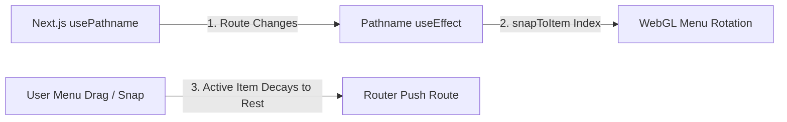

# Navigation Interface & Interactive Subpages

This document details the navigation framework of **No Origins**, specifically the split viewport layout, the high-performance WebGL-based infinite circular menu, route synchronization, the mouse-tracking reactive border glow component, and internal page templates.

---

## 🏛️ Layout Architecture (Split View & Shared Cards)

To support a multi-layered interactive experience, the application utilizes a split-viewport structure and shared card layouts:

### 1. Viewport Split Layout
Defined in [layout.tsx](file:///Users/hiddenstack/Creatives/no-origins/visual-labs/src/app/(base)/layout.tsx), the layout divides the screen:
- **Sphere Section**: Left on desktop (`md:flex-row`), bottom on mobile (`flex-col`). It contains the interactive WebGL canvas overlays ([BackgroundVisualizer.tsx](file:///Users/hiddenstack/Creatives/no-origins/visual-labs/src/components/BackgroundVisualizer.tsx) and [SphereChatInput.tsx](file:///Users/hiddenstack/Creatives/no-origins/visual-labs/src/components/SphereChatInput.tsx)).
- **Sub-page Section**: Right on desktop, top on mobile. It scrolls independently and houses the child route pages. On mobile, it is top-aligned and center-justified (`items-start min-h-full`) to prevent overlapping visualizer controls. Short mobile viewports enforce responsive padding scaling, `100dvh` viewport height bounds, and flex contraction to eliminate text collisions on height-constrained mobile screens.

### 2. Viewport Backdrop Field
The entire viewport is backed by [BackdropField.tsx](file:///Users/hiddenstack/Creatives/no-origins/visual-labs/src/components/BackdropField.tsx) mounted at the root level of `BaseLayout`. This ensures that the reactive particle [DotField.tsx](file:///Users/hiddenstack/Creatives/no-origins/visual-labs/src/components/DotField.tsx) remains visible behind both the canvas sphere and all textual card pages, overlaid with a radial vignette gradient.

### 3. Shared Cards Layout Group
The six internal pages are nested inside the `(cards)` route group [layout.tsx](file:///Users/hiddenstack/Creatives/no-origins/visual-labs/src/app/(base)/(cards)/layout.tsx). Rather than duplicate styling and mount logic:
- The shared layout enforces a `max-w-[450px]` container with custom padding and pointer event routing.
- It is keyed on `pathname` (`key={pathname}`), ensuring that the entry animations replay and the ripple triggers dispatch on every route transition.

---

## 🧭 Infinite Circular Menu: `InfiniteMenu`

The primary site navigation is governed by the interactive, WebGL-rendered [InfiniteMenu.tsx](file:///Users/hiddenstack/Creatives/no-origins/visual-labs/src/components/InfiniteMenu.tsx). It displays site options arranged in a 3D-like circular layout floating above the particle visualizer.

### 1. WebGL Disc & Icon Projection
- **Disc Shaders**: Uses custom vertex and fragment shaders to project flat circular nodes ("discs") onto a 3D plane.
- **Dynamic 2D Canvas Mapping**: Discs are drawn directly on a 2D canvas with glowing borders and centered system vector icons, which are cached as WebGL textures on startup (supporting offline-first loads).
- **Transparency & Layout Safeguards**: WebGL context initialization has `alpha: true` enabled, ensuring a fully transparent canvas backdrop. The container in [BackgroundVisualizer.tsx](file:///Users/hiddenstack/Creatives/no-origins/visual-labs/src/components/BackgroundVisualizer.tsx) uses responsive dimensions `w-[88vw] h-[88vw] max-w-[760px] max-h-[760px]` to prevent clipping rotated items, while sibling absolute text overlays are separated outside overflow-hidden regions.

### 2. Bidirectional Route Synchronization
The menu automatically maps and syncs its state with Next.js app routing:



- **Pathname-to-Rotation**: The menu listens to `usePathname()`. On change, it locates the matching item link and invokes `snapToItem(index)` on the underlying WebGL controller to programmatically rotate the wheel to the correct index.
- **Confirmation-Based Navigation**: When dragging/scrolling on the menu decays to rest (`isMoving` becomes false), a glassmorphic confirmation panel fades in at the bottom center of the menu. It displays the active item's title, description, and an **ENTER** button styled with a border glow matching the active item's custom `glowColor`.
- **Direct Navigation Execution**: Clicking the **ENTER** button triggers the route update (`router.push(activeItem.link)`), providing clear intent and preventing accidental navigation.

### 3. Dynamic Camera Scaling
To maintain a unified visual weight, the menu's camera scale binds dynamically to the configured size of the Liquid Metal Sphere:
$$\text{menuScale} = \text{sphereSize} \times 1.2$$
As the sphere grows or shrinks (due to audio reactivity or manual preset morphing), the menu scales in perfect proportion.

### 4. Interactive Dragging & Click-Forwarding
- **Primary Drag Target**: The Infinite Menu canvas serves as the sole interactive grab target on the home page. Dragging anywhere on the menu canvas spins and rotates the WebGL menu items.
- **Ambient Sphere Interaction**: The underlying `LiquidMetalSphere` is non-interactive and features a slow, continuous ambient rotation to display reflections. Its canvas has `pointer-events-none`.
- **Click Forwarding**: Quick clicks/touches on the Infinite Menu canvas (movement < 6px, duration < 200ms) are intercepted and dispatched as a `trigger-ripple` event to the `window`. Both the `LiquidMetalSphere` and the `InnerCore` listen to this event to render ripple shaders and push the core in sync, preserving micro-interaction responsiveness.

### 5. WebGL Lifecycle & Leak Prevention
To eliminate memory leaks and event listener accumulation during navigation and hot reloading:
- **`ArcballControl.destroy()`**: Removes mouse, touch, and wheel pointer event listeners from the target canvas on unmount.
- **`InfiniteGridMenu.destroy()`**: Cancels active `requestAnimationFrame` loops (`this.rafId`) and explicitly deletes WebGL programs, vertex array objects (VAOs), buffers, and textures from GPU memory.
- **In-place Parameter Mutation**: The scale prop is decoupled from the main context reconstruction hook. A dedicated, lightweight `useEffect` directly modifies `scaleFactor` and `camera.position[2]` in-place, preventing costly unmount-rebuild WebGL loops during scale transitions.

---

## 🎛️ Ambient Controls: `SphereNavBar`

Underneath the page-details info panel sits [SphereNavBar.tsx](file:///Users/hiddenstack/Creatives/no-origins/visual-labs/src/components/SphereNavBar.tsx). It provides direct, non-dragging control options represented by simple, glassmorphic buttons (Square, Triangle, Circle) — **same mapping on web and mobile**:

1.  **Square (Random Shuffle)**: Triggers a random navigation path. When clicked, it selects a random internal route, calls the imperative `spinAndSnap(targetIndex, 2000)` ref method to spin the WebGL Infinite Menu wheel for 2 seconds, and pushes the new route.
2.  **Triangle (Home Navigation)**: Instantly returns the router to `/`. The icon uses responsive optical translation offsets (`max-md:portrait:-translate-y-px`, `max-md:landscape:translate-x-px`, `md:translate-x-px md:-translate-y-px`) to keep the triangular glyph centered within its boundaries.
3.  **Circle (Profile)**: Opens `/profile` (web) or `/(tabs)/profile` (mobile). Active while on the profile route.

---

## 🎨 Interactive Hover Glows: `BorderGlow`

All internal subpages render their content inside the custom [BorderGlow.tsx](file:///Users/hiddenstack/Creatives/no-origins/visual-labs/src/components/BorderGlow.tsx) component. It wraps panels with mouse-sensitive border reflections and neon sweeping trails.

### 1. Pointer Tracking & Geometry
The component registers a pointer movement handler to dynamically calculate:
1. **Edge Proximity**: Calculates how close the mouse pointer is to the nearest card edge ($0.0$ to $1.0$).
2. **Angle**: Calculates the angle in degrees between the card center and the cursor coordinates using $\theta = \text{atan2}(dy, dx)$.

These variables are written directly to the DOM wrapper's inline style attributes:
- `--edge-proximity`
- `--cursor-angle`

[BorderGlow.css](file:///Users/hiddenstack/Creatives/no-origins/visual-labs/src/components/BorderGlow.css) reads these variables to render custom HSL drop-shadows and rotate radial gradients along the borders, minimizing DOM repaints.

### 2. Animated Entrance Sweep
On mount, if `animated={true}` is set, the component initiates a `requestAnimationFrame` timeline that simulates a cursor circling the card:
1. Sweeps the edge proximity factor from `0` to `100` and fades it back to `0`.
2. Sweeps the cursor angle through a $355^\circ$ path (from $110^\circ$ to $465^\circ$).
3. This creates a smooth "glowing sweep" animation that highlights the card boundaries during transition.

---

## 📄 Subpages & Ripple Event Triggering

The Infinite Menu (web + mobile) shares one canonical set of destinations. **Profile is not a menu disc** — open it with ○ on `SphereNavBar`. Interactive Sandbox (`/base`) is retired; use Admin for field/sphere config.

Menu destinations:
- **Labs**: `/labs` (WebGL controls environment).
- **Hyperbase**: `/hyperbase` (presets database explorer).
- **Stories**: `/stories` (procedural text logs).
- **Agent Society**: `/society` (backend agent configurations dashboard).
- **Spotify**: `/spotify` (ambient soundtrack integrations).
- **Credits**: `/credits` (attribution and repository history).
- **Projects**: `/projects` (spatial media hub; mobile has a native browse tab).
- **Community**: `/community` (MagicBento traits wall).
- **Feed**: `/feed` (shared social posts — same Supabase tables as mobile).
- **Capture**: `/capture` (compose post; mobile route is `/compose`).

Also available outside the menu:
- **Profile**: `/profile` (○ nav button). Account dashboard with [UserAvatar.tsx](file:///Users/hiddenstack/Creatives/no-origins/visual-labs/src/components/UserAvatar.tsx); indigo section accent.
- **Admin**: `/admin` (presets / states / stages — replaces the old visitor sandbox).

---

## 💎 Custom Subpage Components

### 1. Magic Bento Grid (`MagicBento`)
Used exclusively on the `/community` route, `<MagicBento />` is an advanced interactive component that presents the 8 characteristics of the No Origins network.
- **GSAP 3D Hover Tilt**: Mouse move handlers calculate normalized $(x, y)$ coordinate offsets relative to the individual cell boundaries. GSAP (`gsap.to`) is utilized to animate the 3D rotation (`rotateX`, `rotateY`) and shadow offset in real-time, yielding a premium physical depth feeling.
- **Magnetic Icon Effect**: Inner action buttons and icons track the cursor using custom magnetic physics handlers, pulling slightly toward the cursor on hover.
- **Bento Stylesheet**: CSS styling tokens are maintained in [MagicBento.css](file:///Users/hiddenstack/Creatives/no-origins/visual-labs/src/components/MagicBento.css), setting up standard grid structures, glass backdrops, and active neon reflections.

### 2. User Avatar (`UserAvatar`)
Renders the authenticated user's profile icon across cards and HUD components.
- **Avatar Resolution Priority**: Checks custom uploaded avatar (`avatar_path` stored in Supabase `media` bucket) first, falls back to OAuth `avatar_url`/`picture`, then Gravatar MD5 hash, and finally initial letter badges.
- **FallbackInitials**: If no photo exists, parses the metadata user initials (or email prefix) and displays them over a custom background reflecting the active `--section-accent` slot theme, maintaining style cohesion.

### 3. Projects Dashboard Underline Tabs vs Global Pill Buttons
- **Global Pill Buttons**: Standard buttons and `[data-slot="button"]` elements inherit `--radius-button: 9999px` via base CSS in [index.css](file:///Users/hiddenstack/Creatives/no-origins/visual-labs/src/index.css) to guarantee pill-shaped CTAs across HUDs, social feed, and admin panels.
- **Segmented Underline Tabs**: Dashboard tab selectors (`My Projects`, `Discovery Hub`, `Trash`) on `/projects` require rectangular, unrounded tabs with border-bottom active indicators. To achieve this, tab buttons specify `data-variant="tab"` and receive an explicit override in [index.css](file:///Users/hiddenstack/Creatives/no-origins/visual-labs/src/index.css):
  ```css
  button[data-variant="tab"] {
    border-radius: 0 !important;
  }
  ```
- Active tabs render `-mb-px border-b-2 border-section text-section` to align seamlessly with the bottom border line of the tab bar.


### 1. CSS Page Entry Animation
To prevent layout snapping during route updates, pages are loaded inside the `.animate-page-enter` utility class defined in [index.css](file:///Users/hiddenstack/Creatives/no-origins/visual-labs/src/index.css). It applies a smooth fade, scale, and blur-removal sequence:

```css
@keyframes page-enter {
  from {
    opacity: 0;
    transform: scale(0.96);
    filter: blur(4px);
  }
  to {
    opacity: 1;
    transform: scale(1);
    filter: blur(0);
  }
}
```

### 2. Window Ripple Dispatcher
To integrate static card pages into the reactive environment, the shared cards layout schedules a window event dispatch on mount and pathname updates:

```typescript
useEffect(() => {
  const event = new CustomEvent("trigger-ripple", {
    detail: {
      x: window.innerWidth / 2,
      y: window.innerHeight / 2,
      intensity: 0.8,
    },
  });
  window.dispatchEvent(event);
}, [pathname]);
```

- **LiquidMetalSphere**: Listens for the `trigger-ripple` event to programmatically inject ripples into the WebGL fragment shader, generating wave trails.
- **AudioEngine**: Intercepts the event to synthesize a high-frequency bubble-pop or bass-impact sound effect, synchronizing audio-visual response on route arrival.
