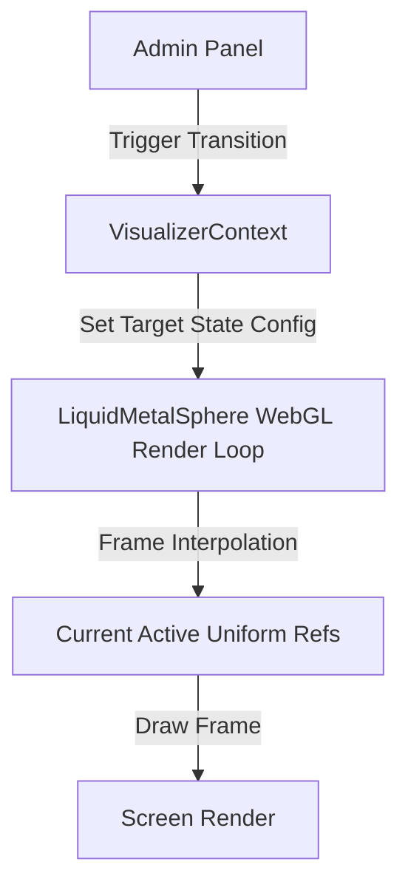

# LiquidMetalSphere Admin-Created States & Transitions Design

This document details the architectural design and parameter mapping for implementing **Admin-Created States** and **Smooth Transitions** for the `LiquidMetalSphere` in the **No Origins** visual-labs workspace.

---

## 🔮 Core Concept: Admin-Created States

Instead of hardcoding default states (such as `DORMANT` or `TURBULENT`), this system enables admins to capture their current visualizer parameters as a custom **State**. 

Once created, these states can be used as target points for smooth transitions, or selected in a mixer/crossfader to blend parameters dynamically.

---

## ⚙️ Component Presets & States Configuration Schema

Rather than keeping flat lists of visualizer parameters, each component (`liquid`, `core`, `field`, `audio`) manages its own presets. A composed **State** is a combination of these individual component preset references:

```typescript
export interface ComponentPreset {
  id: string;
  name: string;
  type: "liquid" | "core" | "field" | "audio";
  settings: Record<string, any>;
}

export interface SphereStateConfig {
  id: string;
  name: string;
  liquidPresetId: string; // references a "liquid" type ComponentPreset
  corePresetId: string;   // references a "core" type ComponentPreset
  fieldPresetId: string;  // references a "field" type ComponentPreset
  audioPresetId: string;  // references an "audio" type ComponentPreset
}
```

### 🎛️ Parameters Groupings
* **`liquid`**: `theme`, `roughness`, `amplitude`, `speed`, `size`, `transparency`, `thickness`, `bulge`, `pop`
* **`core`**: `coreSize`, `coreIntensity`, `coreSpring`, `coreFriction`, `coreBlur`, `coreColor`, `coreFreeWill`, `coreFreeWillSpeed`
* **`field`**: `fieldDotSize`, `fieldGap`, `fieldRepulsionRadius`, `fieldRepulsionStrength`, `fieldSpringTension`, `fieldState`, `rainDirection`, `rainSpeed`, `rainLineLength`, `orbGravityStrength`, `orbSwirlStrength`
* **`audio`**: `droneVolume`, `rippleVolume`, `baseFreq`

---

## ⚡ Animation & Interpolation Architecture

To achieve high-performance (60 FPS) transitions without causing CPU bottlenecks, we use a **Target vs. Active Ref** system in [LiquidMetalSphere.tsx](file:///Users/hiddenstack/Creatives/no-origins/visual-labs/src/components/LiquidMetalSphere.tsx):



1. **Target vs. Current Values**: 
   - [VisualizerContext.tsx](file:///Users/hiddenstack/Creatives/no-origins/visual-labs/src/context/VisualizerContext.tsx) manages the **Target Configuration** (representing the desired target state properties).
   - The WebGL rendering loop in [LiquidMetalSphere.tsx](file:///Users/hiddenstack/Creatives/no-origins/visual-labs/src/components/LiquidMetalSphere.tsx) maintains **Current Active Values** via refs.
2. **Smooth Interpolation**:
   - In each render frame, the active variables slide towards the target values:
     $$\text{current} = \text{current} + (\text{target} - \text{current}) \times \text{interpolationRate}$$
   - This prevents React from having to re-render the HUD sliders 60 times a second during transition while keeping the visual change butter-smooth on screen.

---

## 🎨 Proposed Controls in the Interactive HUD ("States" Tab)

We propose adding a dedicated **"States"** tab to [InteractiveHUD.tsx](file:///Users/hiddenstack/Creatives/no-origins/visual-labs/src/components/InteractiveHUD.tsx) containing:

### 1. State Creator & Manager
* **Save Current State**: A text field and button to capture the current active HUD settings and save them under a custom name.
* **State List**: A list of saved states with actions to:
  - **Morph to State**: Trigger a smooth, animated transition to that configuration.
  - **Overwrite**: Overwrite the state configuration with current HUD values.
  - **Rename / Delete**: Standard management tools.

### 2. Transition Tweaker
* **Transition Duration**: Slider to adjust how long the morph takes (from `0.1s` up to `10.0s`).
* **Easing Curve**: Choose between `Linear`, `Smooth (Exp Decay)`, and `Spring / Elastic` (overshoots the target slightly and wobbles into place to mimic fluid elasticity).

### 3. A-B State Mixer (Morpher)
* **Selectors**: Dropdowns to select two saved configurations: **State A** and **State B**.
* **Blend Slider**: A horizontal crossfader slider (`0%` to `100%`). Dragging the slider dynamically calculates a weighted interpolation of every parameter between State A and State B in real-time, instantly shifting the sphere.
* **XY Pad Mixer (Optional)**: A 2D pad where the user can assign four states to the corners and drag a cursor to blend between all four simultaneously.
