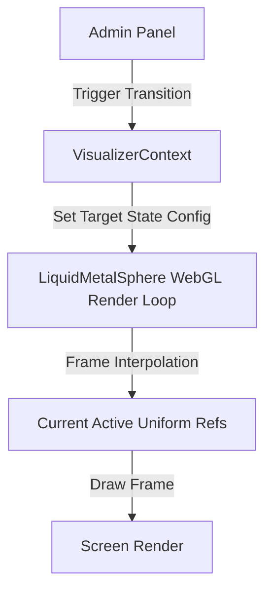

# LiquidMetalSphere Admin-Created States & Transitions Design

This document details the architectural design and parameter mapping for implementing **Admin-Created States** and **Smooth Transitions** for the `LiquidMetalSphere` in the **No Origins** visual-labs workspace.

---

## 🔮 Core Concept: Admin-Created States

Instead of hardcoding default states (such as `DORMANT` or `TURBULENT`), this system enables admins to capture their current visualizer parameters as a custom **State**. 

Once created, these states can be used as target points for smooth transitions, or selected in a mixer/crossfader to blend parameters dynamically.

---

## ⚙️ Component Presets & States Configuration Schema

Rather than keeping flat lists of visualizer parameters, each component (`liquid`, `core`, `field`, `audio`) manages its own presets. A composed **State** is a combination of these individual component preset references mapped via a dynamic dictionary:

```typescript
export interface ComponentPreset {
  id: string;
  name: string;
  type: "liquid" | "core" | "field" | "audio";
  settings: Record<string, any>;
}

export interface SphereStateConfig {
  id: string;
  name: string;
  presets: Record<string, string>; // Maps component type -> presetId
}
```

### 🎛️ Parameters Groupings
* **`liquid`**: `theme`, `roughness`, `amplitude`, `speed`, `size` (Boundary Scale slider, minimum lowered from `0.50x` to `0.10x`), `sphereOffsetX`, `sphereOffsetY` (X/Y screen offset translations), `transparency`, `thickness`, `bulge`, `pop`
* **`core`**: `coreSize`, `coreIntensity`, `coreSpring`, `coreFriction`, `coreBlur`, `coreColor`, `coreFreeWill`, `coreFreeWillSpeed`
* **`field`**: `fieldDotSize`, `fieldGap`, `fieldRepulsionRadius`, `fieldRepulsionStrength`, `fieldSpringTension`, `fieldState`, `rainDirection`, `rainSpeed`, `rainLineLength`, `orbGravityStrength`, `orbSwirlStrength`
* **`audio`**: `audioEnabled` (master ambient sound state), `audioVolume` (master volume level), `droneVolume` (synth pad volume), `rippleVolume` (bubble pop/impact effects volume), `baseFreq` (fundamental drone pitch), `visualReactivityEnabled`, `visualReactivityStrength` (intensity of audio-driven visual displacement)

---

## ⚡ Animation & Interpolation Architecture

To achieve high-performance (60 FPS) transitions without causing CPU bottlenecks, we use a **Target vs. Active Ref** system in [LiquidMetalSphere.tsx](file:///Users/hiddenstack/Creatives/no-origins/visual-labs/src/components/LiquidMetalSphere.tsx):



1. **Target vs. Current Values**: 
   - [VisualizerContext.tsx](file:///Users/hiddenstack/Creatives/no-origins/visual-labs/src/context/VisualizerContext.tsx) manages the **Target Configuration** (representing the desired target state properties).
   - The WebGL rendering loop in [LiquidMetalSphere.tsx](file:///Users/hiddenstack/Creatives/no-origins/visual-labs/src/components/LiquidMetalSphere.tsx) maintains **Current Active Values** via refs.
2. **Smooth Interpolation**:
   - In each render frame, the active variables slide towards the target values:
     $$\text{current} = \text{current} + (\text{target} - \text{current}) \times \text{interpolationRate}$$
   - This prevents React from having to re-render the HUD sliders 60 times a second during transition while keeping the visual change butter-smooth on screen.
4. **Fallback & Component Exclusions**:
   - If a component key is missing from `presets` (e.g. `presets.field` is undefined because the admin unchecked "Field Preset" during state composition), the target value resolves to the current active value in the context.
   - During animation, the interpolater runs on that component's properties with identical start and end values, leaving that component completely unaffected. This allows subset state transitions (e.g. morphing only the audio while keeping the liquid sphere identical).

---

## ❄️ Sphere Stillness & Meditating Core Swap

To support a soft-resting visual transition, the stillness features operate through coordinated mathematical interpolation and preset swapping:

### 1. Stillness Deceleration Easing
When stillness is enabled (`sphereStill` becomes true), the `BackgroundVisualizer` runs a dedicated `requestAnimationFrame` loop to animate a `stillBlend` variable from `0` to `1` over a `2400ms` window:
- **Easing Curve**: Uses an **ease-out cubic** function ($f(t) = 1 - (1 - t)^3$) to ensure a gentle, decelerating wind-down with no mid-animation speed spikes.
- **Shader Modulation**: The uniforms passed to `LiquidMetalSphere` are multiplied by `(1 - stillBlend)`. This pulls `amplitude`, `speed`, and `bulge` values smoothly to zero, settling the sphere into a perfectly smooth round shape.

### 2. Meditating Core Preset Swap
When stillness is activated:
- **Context Snapshot**: The system snapshots all active `core` parameter states (size, intensity, spring, friction, blur, color, freewill, and freewill speed) into `coreSnapshotRef`.
- **Preset Match**: Searches all local and Supabase component presets for a `type === "core"` preset with a trimmed, case-insensitive name containing the word `"MEDITATING"`.
- **Application & Fallback**: If found, the meditating preset is loaded. If no match is found, the system logs a warning containing all available core presets to the console for debugging and leaves the parameters at their baseline.
- **Restoration**: When stillness is deactivated, the baseline parameter values captured in `coreSnapshotRef` are restored back to the visualizer context.

---

## 🎨 Proposed Controls in the Interactive HUD ("States" Tab)

We have a dedicated **"States"** tab in [InteractiveHUD.tsx](file:///Users/hiddenstack/Creatives/no-origins/visual-labs/src/components/InteractiveHUD.tsx) containing:

### 1. State Creator & Manager
* **Save Current State**: A text field and selectors to capture the current active HUD settings.
* **Component Selectors**: Dropdowns and checkboxes in the Admin Panel to select and include/exclude specific component presets.
* **State List**: A list of saved states showing included components and action triggers:
  - **Morph to State**: Trigger a smooth, animated transition to that configuration.
  - **Rename / Delete**: Standard management tools.

### 2. Transition Tweaker
* **Transition Duration**: Slider to adjust how long the morph takes (from `0.1s` up to `10.0s`).
* **Easing Curve**: Choose between `Linear`, `Smooth (Exp Decay)`, and `Spring / Elastic` (overshoots the target slightly and wobbles into place to mimic fluid elasticity).

### 3. A-B State Mixer (Morpher)
* **Selectors**: Dropdowns to select two saved configurations: **State A** and **State B**.
* **Blend Slider**: A horizontal crossfader slider (`0%` to `100%`). Dragging the slider dynamically calculates a weighted interpolation of every parameter between State A and State B in real-time, instantly shifting the sphere.
* **Auto-Play/Pause Morpher**: A play/pause button added next to the blend slider. Clicking it triggers an animation loop that automatically sweeps the blend value back and forth or to the opposite end (duration is `2500ms`). Manual slider interaction cancels the autoplay immediately.
