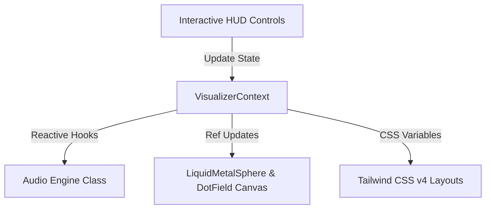

# State Management & Synchronization

This document explains the unified state management architecture in the **No Origins** application, centered around `VisualizerContext` and its interactions with WebGL canvasses and the Audio Engine.

---

## 🔑 Single Source of Truth (SSOT): `VisualizerContext`

To prevent visual drift and asynchronous audio delays, the application stores all variables and tuning parameters inside [VisualizerContext.tsx](file:///Users/hiddenstack/Creatives/no-origins/visual-labs/src/context/VisualizerContext.tsx).

Any control adjustment from the HUD updates this Context, which immediately broadcasts updates to the corresponding engine modules:



---

## 🎨 Theme Synchronization (CSS Variables)

`VisualizerContext` dynamically translates the active design theme selection into CSS variables injected directly into the document root:

- **`--primary-accent`**: Accent/neon indicator colors.
- **`--bg-glass`**: Semi-transparent, blur-backed HUD panel styling.
- **`--glow-color`**: Drop-shadow glow values.
- **`--font-family-name`**: Switch between strict monospaced (`mono`) and rounded sans-serif (`sans`) typography.
- **`--border-glow`**: Glow values for theme borders (e.g. `0 0 15px var(--glow-color)` or `none`).
- **`--border-width`**: Thickness of panels and buttons (e.g. `1px` or double style `3px`).
- **`--border-style-type`**: border style type (e.g. `solid` or `double`).

This pattern allows styles to instantly adapt to global designer updates without requiring manual class toggling.

---

## 🔊 Audio Engine Sync Loops

The context sets up several React `useEffect` loops targeting the global `audioEngine` instance:

```typescript
// Enable/disable the AudioContext
useEffect(() => {
  audioEngine.toggle(audioEnabled);
}, [audioEnabled]);

// Adjust base frequencies and volume levels in real-time
useEffect(() => {
  audioEngine.setVolume(audioVolume);
}, [audioVolume]);

// Dynamic drone modulation based on Orb speed and thickness
useEffect(() => {
  if (audioEnabled) {
    audioEngine.updateDrone(speed, thickness);
  }
}, [speed, thickness, audioEnabled]);
```

---

## ⚡ High-Frequency Ref Synchronization

Parameters that change at **60 frames per second** (such as mouse cursor tracking, drag-interaction physics, or orb screen positions) bypass React state updates entirely to avoid rendering bottlenecks.

Instead, they are managed via a shared **React Ref**:

```typescript
export interface CorePosition {
  x: number;
  y: number;
  vx: number;
  vy: number;
  size: number;
}

const corePositionRef = useRef<CorePosition>({ x: 0, y: 0, vx: 0, vy: 0, size: 120 });
```

- **Writing**: 
  - The `InnerCore` component runs the spring physics and cursor tracking loop, writing coordinates and velocity (`x`, `y`, `vx`, `vy`) to the ref.
  - The WebGL `LiquidMetalSphere` component writes its canvas-computed visual radius bounds (`size`) to `corePositionRef.current.size`.
- **Reading**: 
  - The background `DotField` canvas reads `x`, `y`, and `size` during its animation loops to calculate particle attraction and repulsion forces.
  - The WebGL `LiquidMetalSphere` reads `vx` and `vy` to adjust shader trail fading and motion blur dynamically.
- **Benefit**: Zero React re-renders are triggered during active drag movements, sustaining solid 60+ FPS performance.

---

## 🔒 Authentication & Database Write Gating

To maintain security and prevent database clutter, the context manages state variables related to authentication:

* **`isAuthenticated` (Boolean)**: Reactive state reflecting if the current user has an active Supabase auth session.
* **`isAdminRef` (Ref of Boolean)**: Evaluates if the logged-in user possesses the `admin` role and an `active` status in the `profiles` table.
* **Write Gating Loop**:
  - Functions that modify database state (such as saving component presets, editing design themes, or mapping environment stages) check the value of `isAdminRef.current` synchronously.
  - If the user is an authorized admin, updates are pushed via Supabase queries to the postgres database.
  - If the user is an anonymous visitor or standard user, database calls are bypassed, and updates are committed exclusively to the browser's `localStorage` (local-only fallback mode).

---

## ⏳ Boot Loader Lifecycle

To hide visual layout snap and the default-to-active parameter "flash" on startup, a global boot sequence is coordinated inside `VisualizerProvider`:

1. **`isBooting` State**: Initialized to `true`. While `true`, the `BootLoader` component renders a full-screen loader animation blocking visitor clicks.
2. **Asynchronous Ingestion**: The provider concurrently fetches data on mount:
   - Customized design themes (`localStorage`).
   - Component presets (Supabase query falling back to `localStorage`).
   - Composed states (Supabase query falling back to `localStorage`).
   - Stage-to-state environment assignments (Supabase query).
3. **Environment State Resolution**: 
   - The deployment's stage is resolved via `process.env.NEXT_PUBLIC_APP_STAGE` (mapped to `previewStage`).
   - Once all tables have loaded, the provider looks up the state ID assigned to the active stage and applies it instantly (`instant: true`, `preserveAudio: true`).
4. **Volume Preservation**: The instant-apply uses the `preserveAudio` option which checks the client's master sound toggle preference (`no_origins_audio_enabled`) in `localStorage` rather than blindly activating the stage's preset volume, ensuring sound preference is respected across page refreshes.
5. **Dismissal**: After the initial environment state is applied (or if data fetches timeout after a fallback limit of 8 seconds), `isBooting` is set to `false`, causing the boot loader overlay to fade out cleanly.
