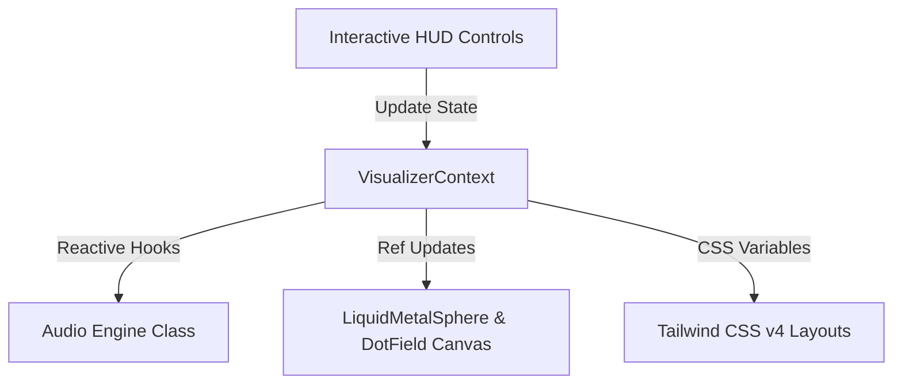

# State Management & Synchronization

This document explains the unified state management architecture in the **No Origins** application, centered around `VisualizerContext` and its interactions with WebGL canvasses and the Audio Engine.

---

## 🔑 Single Source of Truth (SSOT): `VisualizerContext`

To prevent visual drift and asynchronous audio delays, the application stores all variables and tuning parameters inside [VisualizerContext.tsx](file:///Users/hiddenstack/Creatives/no-origins/visual-labs/src/context/VisualizerContext.tsx).

Any control adjustment from the HUD updates this Context, which immediately broadcasts updates to the corresponding engine modules:



---

## 🎨 Theme Synchronization (CSS Variables)

`VisualizerContext` dynamically translates the active design theme selection into CSS variables injected directly into the document root:

- **`--primary-accent`**: Accent/neon indicator colors.
- **`--bg-glass`**: Semi-transparent, blur-backed HUD panel styling.
- **`--glow-color`**: Drop-shadow glow values.
- **`--font-family-name`**: Switch between strict monospaced (`mono`) and rounded sans-serif (`sans`) typography.

This pattern allows Tailwind styles to instantly adapt to global designer updates without requiring manual Tailwind class toggling.

---

## 🔊 Audio Engine Sync Loops

The context sets up several React `useEffect` loops targeting the global `audioEngine` instance:

```typescript
// Enable/disable the AudioContext
useEffect(() => {
  audioEngine.toggle(audioEnabled);
}, [audioEnabled]);

// Adjust base frequencies and volume levels in real-time
useEffect(() => {
  audioEngine.setVolume(audioVolume);
}, [audioVolume]);

// Dynamic drone modulation based on Orb speed and thickness
useEffect(() => {
  if (audioEnabled) {
    audioEngine.updateDrone(speed, thickness);
  }
}, [speed, thickness, audioEnabled]);
```

---

## ⚡ High-Frequency Ref Synchronization

Parameters that change at **60 frames per second** (such as mouse cursor tracking, drag-interaction physics, or orb screen positions) bypass React state updates entirely to avoid rendering bottlenecks.

Instead, they are managed via a shared **React Ref**:

```typescript
const corePositionRef = useRef({ x: 0, y: 0, size: 120 });
```

- **Writing**: The WebGL `LiquidMetalSphere` component writes its current core coordinates directly to `corePositionRef.current`.
- **Reading**: The background `DotField` canvas reads from the same ref during its animation loops to calculate gravitational and swirl attraction forces on particles.
- **Benefit**: Zero React re-renders are triggered during active drag movements, sustaining solid 60+ FPS performance.
