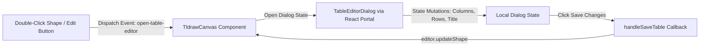

# Custom Table Whiteboard Shape

This document details the technical implementation, shape definition, portal-based editing dialog, and integration of the custom interactive Table whiteboard shape inside the No Origins project workspace canvas.

---

## 📐 Shape Definition & Canvas Rendering

The table shape is registered as a custom Tldraw shape `"table-card"`. It allows users to place, resize, and interact with tabular data directly on the whiteboard canvas.

### 1. Shape Schema (`TableCardShape`)
Defined in [TableCardUtil.tsx](file:///Users/hiddenstack/Creatives/no-origins/visual-labs/src/components/projects/TableCardUtil.tsx), the shape properties extend `TLBaseShape` with a custom structure:

```typescript
export type TableCardShape = TLBaseShape<
  "table-card",
  {
    title: string;
    headers: string[];
    rows: string[][];
    w: number;
    h: number;
  }
>;
```

### 2. Canvas Component (`TableCardComponent`)
The custom shape is rendered inside a Tldraw HTML container wrapper (`HTMLContainer`):
* **Visual Presentation**: Styled as a semi-transparent glassmorphic panel (`backdrop-blur-xl`) with a monospaced font, thin borders, and subtle glows that reflect the active route's accent color (via `--color-section`).
* **Interaction Guards**: Double-clicking the card or clicking the Pencil icon triggers the page-level editing dialog. To prevent Tldraw canvas gestures (e.g., panning, zooming) from conflicting with table scrolling and user actions, standard mouse and pointer events are captured and stopped via `e.stopPropagation()` and `editor.markEventAsHandled(e)`.

---

## 🖥️ Portal-Based Stable Editor (`TableEditorDialog.tsx`)

To avoid layout hydration mismatches and prevent rendering resets when resizing or repositioning shapes on the canvas, the editing UI is decoupled from the canvas rendering loop.



### 1. Decoupled Communication
* When the user initiates edit mode, the table card dispatches a custom window event `"open-table-editor"` passing the `shapeId` and current `shapeProps`.
* The parent [TldrawCanvas.tsx](file:///Users/hiddenstack/Creatives/no-origins/visual-labs/src/components/projects/TldrawCanvas.tsx) listens for this event, caches the active shape properties in state, and sets `activeTableShape`.

### 2. Dialog Capabilities
Implemented in [TableEditorDialog.tsx](file:///Users/hiddenstack/Creatives/no-origins/visual-labs/src/components/projects/TableEditorDialog.tsx), the editor renders at the document level using a **React Portal** (`createPortal(..., document.body)`). It provides:
* **Cell & Header Inputs**: Inline inputs for column headers and data cell values.
* **Structural Actions**:
  * **Add Column / Add Row**: Dynamically inserts new items into the headers list and corresponding rows array.
  * **Delete Column / Delete Row**: Removes items from headers/rows. Includes constraints to prevent reducing the table below 1 column or 1 row.
* **Saving States**: Saving calls `onSave()`, which executes `editor.updateShape` with the modified data payload, updating the Tldraw canvas store and triggering Supabase autosave.

---

## 🔗 Canvas & Tooling Integration

The Table shape is seamlessly integrated into the custom workspace environment.

### 1. Default Toolbar
Inside [TldrawCanvas.tsx](file:///Users/hiddenstack/Creatives/no-origins/visual-labs/src/components/projects/TldrawCanvas.tsx), the toolbar content is overridden to append a Table creation button.
* Clicking the button triggers `handleAddTableCard()`, which spawns a default 3x3 table (`"table-card"`) in the center of the viewport:
  * Title: `"Untitled Table"`
  * Headers: `["Column 1", "Column 2", "Column 3"]`
  * Rows: `[["Data 1", "Data 2", "Data 3"], ["Data 4", "Data 5", "Data 6"]]`
  * Bounds: `w: 480, h: 280`

### 2. Command Palette Integration
Shortcuts to add tables are added to the custom Shadcn-based `<CommandDialog>` in the canvas header. Users can invoke the command palette (`Cmd+K`) and select **Add Table** to spawn a table card immediately at the center of the viewport.

---

## 🎨 Custom Styling Rules (`TldrawCustom.css`)

Defined in [TldrawCustom.css](file:///Users/hiddenstack/Creatives/no-origins/visual-labs/src/components/projects/TldrawCustom.css), table styles utilize CSS variables to adapt to the active section's visual theme:
* **Accent Highlighting**: Table grid scrollbars, border hover effects, and input focus outlines inherit the active section's color variables:
  * `--section-accent`
  * `hsl(var(--section-accent-hsl) / 0.15)`
* **Typography**: Monospace font families are applied across table headers, cards, and input overlays to preserve the console/terminal aesthetic of No Origins.
